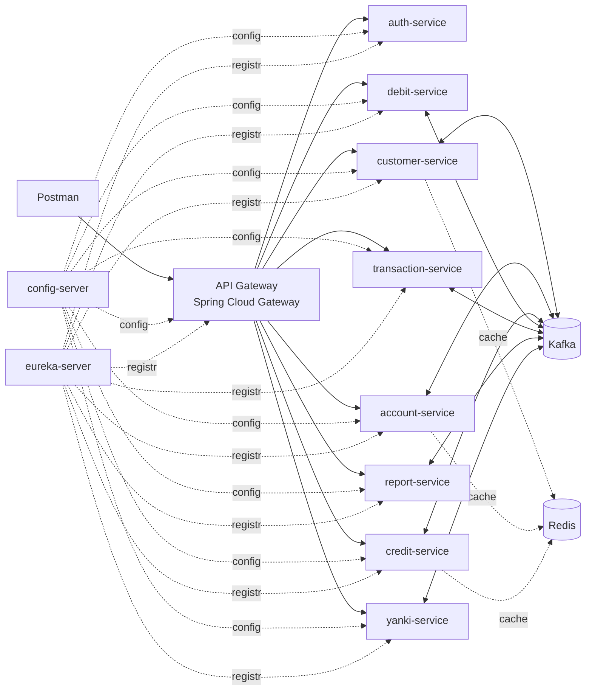

# Bootcamp Microservicios — Sistema Bancario
### Guía de planificación del proyecto (Partes I, II y III)

> Documento de referencia para entender el proyecto completo **antes de implementar**.
> Todo lo marcado como **[Propuesta]** es una decisión de diseño sugerida (no viene en el enunciado). Lo demás sale del enunciado.
>
> **Estado (2026-09-23):** esta guía es la visión general. El detalle vigente está en `bootcamp-bank-microservices-definition.md` (mapa de servicios, Gateway, eventos, demo, pendientes) y en `services/<servicio>.md`. **Si algo difiere, prevalecen esos documentos.** Las secciones 7.1, 7.5, 7.6, 9 y 12 se alinearon con ellos.

---

## 1. Resumen ejecutivo

Se construye, de forma incremental en tres etapas, un **sistema bancario basado en microservicios** que gestiona clientes, cuentas (pasivos), créditos y tarjetas (activos), movimientos, transferencias, reportes y un monedero móvil (**Yanki**).

| Parte | Foco | Qué se agrega |
|---|---|---|
| **I** | Base del sistema | CRUD de clientes y productos, reglas de negocio, MongoDB, REST, Config Server |
| **II** | Robustez y ecosistema | Eureka, API Gateway, Resilience4j, perfiles VIP/PYME, transferencias, reportes, tests + Jacoco, Checkstyle, Docker |
| **III (Final)** | Arquitectura orientada a eventos | Kafka, JWT, Redis, tarjetas de débito, pagos a terceros, Yanki, restricción de deuda vencida, Postman |

**Restricción clave de entrega:** cada microservicio tiene **su propio repositorio** en GitHub y la entrega final es **individual**.

---

## 2. Stack tecnológico

### 2.1 Obligatorio (según enunciado)

| Área | Tecnología |
|---|---|
| Lenguaje | Java 11 o 17 |
| Framework | Spring Boot |
| Reactividad | RxJava (con Spring; controladores reactivos) |
| Build | Maven |
| Base de datos | MongoDB (NoSQL, documentos) |
| Acceso a datos | Spring Data (sin SQL dinámico, **sin `@Query`**) |
| Configuración externa | Spring Cloud Config Server |
| Boilerplate | Lombok |
| Logging | Logback (niveles adecuados) |
| Diagramas | UML, draw.io (arquitectura), diagramas de secuencia por microservicio |
| Contratos | OpenAPI (uno por microservicio) |
| Pruebas manuales | Postman (no hay interfaz gráfica) |
| Repositorio | Git + GitHub (un repo por microservicio) |

### 2.2 Se incorpora en Parte II

| Área | Tecnología |
|---|---|
| Calidad de código | Checkstyle (plugin en `pom.xml`) |
| Service discovery | Eureka Server + registro de todos los MS + panel de control |
| API Gateway | Spring Cloud Gateway |
| Resiliencia | Resilience4j — Circuit Breaker + **timeout de 2 s** |
| Testing | Tests unitarios + **Jacoco** (reporte de cobertura) |
| Contenedores | Docker, un contenedor por microservicio *(deseable)* |
| Patrones de diseño | Aplicar y documentar patrones (ver §5.4) |

### 2.3 Se incorpora en Parte III

| Área | Tecnología |
|---|---|
| Mensajería | **Kafka** como message broker (arquitectura orientada a eventos) |
| Seguridad | **JWT** (autenticación y autorización) |
| Caché | **Redis** para datos maestros/catalogados |
| Pruebas | Unit tests con mocks para todo método público nuevo + reporte de coverage |
| Colecciones Postman | Repositorio dedicado con los proyectos Postman |

### 2.4 Decisiones de stack sugeridas **[Propuesta]**

- **Java 17 + Spring Boot 3.x**: el enunciado permite 11 o 17, pero Boot 3 exige 17 y es lo vigente. Verificar que la versión de Spring Cloud sea compatible con la de Boot.
- **Spring WebFlux + RxJava 3**: WebFlux funciona sobre Reactor, pero Spring adapta tipos RxJava 3 (`Single`, `Maybe`, `Flowable`, `Completable`) en controladores. Con Spring Data Reactive MongoDB puede usarse `RxJava3CrudRepository` para que los repositorios ya devuelvan tipos RxJava.
- **Spring Data Reactive MongoDB** (driver reactivo) para mantener el flujo reactivo de punta a punta.
- **Kafka**: Spring for Apache Kafka o Reactor Kafka (esta última encaja mejor con el modelo reactivo).
- **Generación de código contract-first**: `openapi-generator-maven-plugin` (generador `spring`, `interfaceOnly=true`, `delegatePattern` o similar). Ojo: el generador reactivo produce tipos Reactor (`Mono/Flux`); hay que decidir si se adapta en el borde del adaptador REST o se ajusta la plantilla para RxJava.
- **Mapeos**: MapStruct (junto con Lombok) entre DTO ↔ dominio ↔ documento.
- **Testing**: JUnit 5, Mockito, `StepVerifier`/`TestObserver` según el tipo reactivo, Testcontainers (Mongo/Kafka/Redis) para integración *(opcional)*.
- **Orquestación local**: `docker-compose` con Mongo, Kafka (+ Zookeeper o KRaft), Redis y los microservicios.

---

## 3. Prácticas y principios de desarrollo

### 3.1 Contract-first (OpenAPI)

1. Se **escribe primero el contrato** `openapi.yaml` de cada microservicio.
2. Se generan interfaces/DTOs desde el contrato con el plugin de Maven.
3. La implementación **cumple el contrato**, nunca al revés.
4. El contrato se versiona en el repo del microservicio y se usa como fuente para Postman.
5. URLs y nombres **en inglés**, siguiendo lineamientos REST (sustantivos en plural, verbos HTTP correctos, códigos de estado adecuados).

Ejemplo de convención **[Propuesta]**:

| Operación | Método | Ruta |
|---|---|---|
| Crear | `POST` | `/api/v1/customers` |
| Listar | `GET` | `/api/v1/customers` |
| Obtener uno | `GET` | `/api/v1/customers/{id}` |
| Actualizar | `PUT` | `/api/v1/customers/{id}` |
| Eliminar | `DELETE` | `/api/v1/customers/{id}` |

### 3.2 Arquitectura hexagonal (puertos y adaptadores) **[Propuesta]**

Aísla el dominio de frameworks, base de datos y mensajería. Encaja muy bien con este proyecto porque en la Parte III hay que **cambiar el mecanismo de comunicación (REST → Kafka)** sin tocar la lógica de negocio.

```
com.bank.<service>
├── domain                      ← negocio puro, sin Spring
│   ├── model                   (entidades, value objects)
│   ├── exception               (excepciones de dominio)
│   └── service                 (reglas de negocio sin infraestructura)
├── application                 ← casos de uso
│   ├── port
│   │   ├── in                  (interfaces de casos de uso)
│   │   └── out                 (interfaces: repositorio, publisher de eventos, caché)
│   └── usecase                 (implementación de los puertos de entrada)
└── infrastructure              ← adaptadores
    ├── adapter
    │   ├── in
    │   │   ├── rest            (controllers que implementan el contrato OpenAPI)
    │   │   └── kafka           (consumers de eventos)
    │   └── out
    │       ├── persistence     (Spring Data MongoDB + documentos)
    │       ├── kafka           (producers)
    │       └── cache           (Redis)
    ├── mapper
    └── config
```

Reglas:
- `domain` **no depende** de Spring, Mongo, Kafka ni de código generado.
- Los casos de uso dependen solo de **puertos** (interfaces).
- Los adaptadores implementan los puertos de salida y llaman a los de entrada.
- Inyección **por constructor** (`@RequiredArgsConstructor` de Lombok).

### 3.3 Otras prácticas exigidas

- **Database per service**: ningún MS toca tablas/colecciones de otro.
- **Configuración externalizada**: nada de configuración en el código; todo en Config Server.
- **Programación funcional y reactiva**: lambdas y Streams API bien usados; sin bloqueos (`block()`, `blockingGet()`) en el flujo.
- **Comentarios** (Javadoc) en todas las clases y métodos.
- **Logging** con Logback y niveles correctos (`ERROR` fallos, `WARN` anomalías, `INFO` hitos de negocio, `DEBUG` detalle técnico).
- **CRUD completo** (Create, FindAll, Update, Delete) + endpoints REST por cada entidad de negocio.
- **Sin `@Query` ni consultas dinámicas**: usar *derived queries* de Spring Data (`findByCustomerIdAndType...`).
- **Diagramas UML** y de secuencia mantenidos junto al código.

### 3.4 Patrones de diseño (Parte II) **[Propuesta de dónde aplicarlos]**

| Patrón | Uso sugerido |
|---|---|
| **Strategy** | Reglas de validación por tipo de cliente/cuenta (Personal, VIP, Empresarial, PYME) |
| **Factory** | Creación de cuentas/créditos según tipo |
| **Builder** | Construcción de entidades y eventos (Lombok `@Builder`) |
| **Chain of Responsibility** | Cadena de validaciones al abrir producto (deuda vencida, límites, requisitos) |
| **Adapter** | Conversión entre tipos Reactor/RxJava y en los puertos |
| **Observer / Event** | Publicación y consumo de eventos en Kafka |

---

## 4. Descripción del sistema

Un **banco** administra **clientes** (personas y empresas) que contratan **productos**:

- **Pasivos (cuentas bancarias):** ahorro, corriente, plazo fijo.
- **Activos (créditos):** crédito personal, crédito empresarial, tarjeta de crédito.
- **Tarjeta de débito** (Parte III), asociada a cuentas bancarias.

Los clientes operan: depósitos, retiros, pagos de créditos, consumos con tarjeta de crédito, transferencias, consulta de saldos y movimientos. Además se agrega **Yanki**, un monedero móvil que funciona incluso para quien **no** es cliente del banco.

El sistema **no tiene interfaz gráfica**: todo se valida con **Postman**.

---

## 5. Requisitos funcionales

Leyenda de fase: **P1**, **P2**, **P3** = parte del enunciado donde aparece.

### 5.1 Clientes

| ID | Requisito | Fase |
|---|---|---|
| RF-01 | Gestionar información de clientes (CRUD) | P1 |
| RF-02 | Tipos de cliente: **Personal** y **Empresarial** | P1 |
| RF-03 | Nuevos perfiles: **Personal VIP** y **Empresarial PYME** | P2 |

### 5.2 Cuentas bancarias (pasivos)

| ID | Requisito | Fase |
|---|---|---|
| RF-10 | **Ahorro**: sin comisión de mantenimiento, con límite máximo de movimientos mensuales | P1 |
| RF-11 | **Corriente**: con comisión de mantenimiento, sin límite de movimientos | P1 |
| RF-12 | **Plazo fijo**: sin comisión de mantenimiento; solo un movimiento (retiro o depósito) en un **día específico del mes** | P1 |
| RF-13 | Cliente **personal**: máximo **una** cuenta de ahorro, **una** cuenta corriente y/o cuentas a plazo fijo | P1 |
| RF-14 | Cliente **empresarial**: **no** puede tener ahorro ni plazo fijo; **sí** múltiples cuentas corrientes | P1 |
| RF-15 | Cuentas empresariales: **uno o más titulares** y **cero o más firmantes autorizados** | P1 |
| RF-16 | Las cuentas tienen un **monto mínimo de apertura** (puede ser 0) | P2 |
| RF-17 | **VIP**: cuenta de ahorro con **monto mínimo promedio diario mensual**; requiere **tarjeta de crédito** vigente en el banco al crear la cuenta | P2 |
| RF-18 | **PYME**: cuenta corriente **sin comisión de mantenimiento**; requiere **tarjeta de crédito** en el banco al crear la cuenta | P2 |
| RF-19 | Toda cuenta tiene un **máximo de transacciones (depósitos + retiros) sin comisión**; al superarlo se cobra comisión por cada transacción | P2 |

### 5.3 Créditos y tarjetas (activos)

| ID | Requisito | Fase |
|---|---|---|
| RF-20 | **Crédito personal**: solo **uno** por persona | P1 |
| RF-21 | **Crédito empresarial**: **más de uno** por empresa | P1 |
| RF-22 | **Tarjeta de crédito** personal o empresarial | P1 |
| RF-23 | Un cliente puede tener crédito **sin** tener cuenta bancaria | P1 |
| RF-24 | Pago de productos de crédito por el cliente | P1 |
| RF-25 | Consumos con tarjeta de crédito **limitados por su línea de crédito** | P1 |
| RF-26 | Un cliente puede pagar **cualquier producto de crédito de terceros** | P3 |

### 5.4 Operaciones y consultas

| ID | Requisito | Fase |
|---|---|---|
| RF-30 | Depósitos y retiros en cuentas bancarias | P1 |
| RF-31 | Consultar **saldos disponibles** (cuentas y tarjetas de crédito) | P1 |
| RF-32 | Consultar **todos los movimientos** de un producto de un cliente | P1 |
| RF-33 | **Transferencias** entre cuentas del mismo cliente y a **terceros del mismo banco** | P2 |

### 5.5 Reportes

| ID | Requisito | Fase |
|---|---|---|
| RF-40 | Reporte **completo y general por producto** en un **intervalo de tiempo** dado por el usuario | P2 |
| RF-41 | Reporte de los **últimos 10 movimientos** de tarjeta de débito y de crédito | P2 |

### 5.6 Tarjeta de débito

| ID | Requisito | Fase |
|---|---|---|
| RF-50 | El cliente puede tener **tarjetas de débito asociadas a sus cuentas** | P3 |
| RF-51 | El cliente puede **realizar pagos con la tarjeta de débito** | P3 |

### 5.7 Restricción de deuda

| ID | Requisito | Fase |
|---|---|---|
| RF-60 | Un cliente **no puede adquirir ningún producto** si tiene **deuda vencida** en algún producto de crédito | P3 |

### 5.8 Yanki (monedero móvil)

| ID | Requisito | Fase |
|---|---|---|
| RF-70 | **No** requiere ser cliente del banco | P3 |
| RF-71 | Registro con: **documento** (DNI, CEX o Pasaporte), **número de celular**, **IMEI** y **correo electrónico** | P3 |
| RF-72 | Enviar y recibir pagos **solo con el número de celular** | P3 |
| RF-73 | Asociar el monedero a una **tarjeta de débito** del banco: el saldo se carga/acredita **solo a la cuenta principal** asociada a esa tarjeta | P3 |

---

## 6. Requisitos no funcionales

| ID | Requisito | Fase |
|---|---|---|
| RNF-01 | Microservicios REST con Spring Boot + Maven | P1 |
| RNF-02 | Patrón **database per service** (MongoDB) | P1 |
| RNF-03 | Inyección de dependencias por constructor | P1 |
| RNF-04 | Config Server para propiedades externalizadas; **sin configuración en el código** | P1 |
| RNF-05 | Nombres de clases, métodos y URLs **en inglés** | P1 |
| RNF-06 | Lombok para reducir código | P1 |
| RNF-07 | Logging con Logback, nivel adecuado | P1 |
| RNF-08 | Spring Data; sin SQL dinámico ni `@Query` | P1 |
| RNF-09 | CRUD completo por entidad + endpoints REST, con lineamientos REST | P1 |
| RNF-10 | Uso de lambdas y Streams | P1 |
| RNF-11 | Clases y métodos comentados | P1 |
| RNF-12 | **Draw.io** con el diseño de la solución (mantenido en el tiempo) | P1 / P3 |
| RNF-13 | **Diagramas de secuencia** por microservicio y **UML** | P1 |
| RNF-14 | **Contratos OpenAPI** por microservicio | P1 |
| RNF-15 | **Checkstyle** en `pom.xml` | P2 |
| RNF-16 | **Eureka** (registro + panel) con todos los MS registrados | P2 |
| RNF-17 | **Spring Cloud Gateway** como API Gateway | P2 |
| RNF-18 | **Circuit Breaker** con Resilience4j + **timeout 2 s** | P2 |
| RNF-19 | Patrones de diseño de software | P2 |
| RNF-20 | **Tests unitarios + Jacoco** (reporte de cobertura) | P2 |
| RNF-21 | Docker, un contenedor por MS | P2 *(deseable)* |
| RNF-22 | Programación funcional y reactiva; Streams correctamente | P2 / P3 |
| RNF-23 | Todo método público **nuevo** con test unitario (mocks donde corresponda) y **reporte de coverage** | P3 |
| RNF-24 | **Arquitectura orientada a eventos con Kafka** | P3 |
| RNF-25 | Los **nuevos MS no invocan otros MS por REST** | P3 |
| RNF-26 | Controladores nuevos **reactivos** (RxJava + Spring) | P3 |
| RNF-27 | **JWT** para autenticación y autorización | P3 |
| RNF-28 | **Redis** como caché de datos maestros/catalogados | P3 |
| RNF-29 | Repositorio con **proyectos Postman** para probar las APIs | P3 |
| RNF-30 | **Un repositorio por microservicio**; entrega **individual** | P1 / P3 |

---

## 7. Arquitectura de solución **[Propuesta]**

### 7.1 Microservicios de negocio

| Microservicio | Responsabilidad | Datos propios (MongoDB) |
|---|---|---|
| `customer-service` | Clientes, tipos (personal/empresa) y perfiles (Standard, VIP, PYME) | `customers` |
| `account-service` | Cuentas, titulares, firmantes, catálogo de condiciones, saldo y reglas de movimiento | `accounts`, `account_products`, `account_operations` |
| `credit-service` | Créditos, tarjetas de crédito, pagos, consumos; fuente de la deuda vencida | `credits`, `credit_cards`, `credit_operations` |
| `debit-service` | Tarjetas de débito, cuenta principal asociada, pagos con débito | `debit_cards`, `debit_payments` |
| `transaction-service` | Historial de movimientos; puerta de depósitos, retiros y transferencias (saga) | `transactions`, `transfers` |
| `report-service` | Reportes por producto/intervalo y últimos 10 movimientos (solo lectura) | P2: ninguna; P3: read model propio |
| `yanki-service` | Monederos, pagos por celular, asociación con tarjeta de débito (saga) | `wallets`, `wallet_payments` |
| `auth-service` | Usuarios, login y emisión de JWT (RS256) | `users` |

> **Decisión:** se implementan todos los servicios sin fusionarlos; `debit-service` es independiente de `account-service`. Se respeta *database per service*. Puertos, fases y read models: ver la definición general, sección 1.

### 7.2 Componentes de infraestructura

| Componente | Función |
|---|---|
| `config-server` | Propiedades externalizadas (repo Git de configuración) |
| `eureka-server` | Registro y descubrimiento de servicios |
| `api-gateway` | Punto de entrada único, ruteo, validación de JWT, circuit breaker |
| MongoDB | Una base/colección por servicio |
| Kafka | Bus de eventos entre servicios |
| Redis | Caché de datos maestros |

### 7.3 Vista general



### 7.4 Comunicación entre servicios: el punto delicado

El enunciado impone dos cosas que hay que reconciliar:

- **P1 / P2:** los MS se comunican de forma tradicional (REST, con Eureka + Gateway + circuit breaker).
- **P3:** los **nuevos** MS **no pueden llamar por REST** a otros; deben usar **eventos Kafka**.

Estrategia sugerida:

1. **Reglas que dependen de otro servicio** (ej.: "no puede adquirir producto con deuda vencida", "VIP necesita tarjeta de crédito") → cada servicio mantiene una **copia local mínima** (*read model*) actualizada por eventos de Kafka, en lugar de consultar por REST.
2. **Datos maestros** (tipos de cliente, tipos de producto, parámetros de comisión/límites) → cacheados en **Redis**.
3. **Operaciones que cruzan servicios** (transferencia, pago con débito, Yanki → cuenta) → **saga orquestada**: un servicio dueño de la operación (el orquestador) guarda el estado, envía los comandos a los demás y ejecuta la compensación si algo falla. Los participantes solo responden al comando. Orquestadores: `transaction-service` (transferencias), `debit-service` (pago con débito) y `yanki-service` (pago Yanki).
4. **Circuit breaker + timeout 2 s** se aplica a las llamadas REST existentes (P2) y a las llamadas salientes del Gateway.

### 7.5 Eventos Kafka candidatos

> La matriz completa (productores, consumidores y comandos) está en la definición general, sección 4. Resumen:

| Evento / Tópico | Productor | Consumidores |
|---|---|---|
| `customer.created/updated/deleted` | customer | account, credit, debit, yanki, auth |
| `account.created/updated/deleted` | account | transaction, debit, report |
| `account.movement.applied/rejected/reversed` | account | transaction |
| `credit.created/updated/closed`, `credit.card.*` | credit | account (tarjeta activa), report |
| `credit.payment.registered`, `credit.card.charge.registered` | credit | transaction |
| `credit.overdue.detected` / `credit.overdue.cleared` | credit | account, debit (bloqueo de adquisición) |
| `debit.card.*`, `debit.payment.completed/failed` | debit | yanki, report |
| `transaction.registered/failed`, `transaction.reversed`, `transaction.reversal.failed` | transaction | debit, yanki, report |
| `transfer.completed/failed` | transaction | *(trazabilidad)* |
| `yanki.*` | yanki | *(trazabilidad)* |
| Comandos: `transaction.movement.requested` (+ reversal), `debit.payment.requested`, `yanki.movement.requested` (+ reversal) | transaction, debit, yanki | account, transaction |

### 7.6 Seguridad (JWT) **[Propuesta]**

- `auth-service` emite el token (RS256, 30 min) con login por **documento + contraseña**.
- El **Gateway valida** el JWT con la clave pública (publicada por Config Server y en JWKS); cada servicio autoriza por rol y `customerId`.
- Roles: `ADMIN`, `TELLER`, `CUSTOMER`, `YANKI_USER` (solo monedero).
- Rutas públicas: `POST /auth/login`, `POST /auth/register` (solo Yanki: documento y contraseña) y `GET /.well-known/jwks.json`.
- Flag `security.enabled`: `false` en P1/P2, `true` en P3. Detalle: definición general, sección 6.

---

## 8. Reglas de negocio (resumen de validaciones)

| # | Regla | Servicio responsable |
|---|---|---|
| 1 | Personal: máx. 1 ahorro, 1 corriente; plazo fijo permitido | account |
| 2 | Empresarial: sin ahorro ni plazo fijo; N corrientes | account |
| 3 | Empresarial: ≥1 titular, ≥0 firmantes | account |
| 4 | Ahorro: tope de movimientos mensuales | account / transaction |
| 5 | Plazo fijo: 1 movimiento en el día del mes definido | account / transaction |
| 6 | Corriente: cobra comisión de mantenimiento (excepto PYME) | account |
| 7 | Monto mínimo de apertura (≥ 0) | account |
| 8 | VIP: ahorro con promedio diario mínimo mensual + tarjeta de crédito previa | account (+ read model de credit) |
| 9 | PYME: corriente sin comisión + tarjeta de crédito previa | account (+ read model de credit) |
| 10 | Personal: 1 solo crédito; Empresarial: varios | credit |
| 11 | Crédito sin necesidad de cuenta | credit |
| 12 | Consumo de tarjeta de crédito ≤ línea disponible | credit |
| 13 | Transacciones sobre el máximo libre → comisión por transacción | transaction / account |
| 14 | **Deuda vencida bloquea adquirir cualquier producto** | credit (fuente) + todos los que crean productos |
| 15 | Pago de crédito de terceros permitido | credit |
| 16 | Débito: pago afecta la cuenta principal asociada | debit-card / account |
| 17 | Yanki: registro sin ser cliente (documento, celular, IMEI, email) | yanki |
| 18 | Yanki asociado a débito: carga/acredita solo la cuenta principal | yanki / debit-card |

---

## 9. Modelo de datos preliminar **[Propuesta]**

> Modelo resumido. El modelo vigente (aggregates, value objects, colecciones e índices) está en la sección 3 y 6 de cada `services/<servicio>.md`.

```text
Customer      { id, type: PERSONAL|BUSINESS, profile: STANDARD|VIP|PYME,
                documentType, documentNumber, name, email, phone, status }

Account       { id, customerId, type: SAVINGS|CHECKING|FIXED_TERM, balance,
                holders[], authorizedSigners[], movementDayOfMonth (plazo fijo),
                version }                    // límites y comisiones: AccountProduct

Credit        { id, customerId, type: PERSONAL|BUSINESS, amount, balance,
                dueDate, status: ACTIVE|OVERDUE|PAID, version }

CreditCard    { id, customerId, creditLimit, availableBalance, dueDate,
                status, version }

DebitCard     { id, customerId, cardNumber (enmascarado), linkedAccounts
                (accountIds + mainAccountId), status }

Transaction   { id, operationId, productId, productType, type: DEPOSIT|WITHDRAWAL|
                TRANSFER_IN|TRANSFER_OUT|PAYMENT|CHARGE|FEE|DEBIT_PAYMENT|
                YANKI_PAYMENT_*, amount, date, status }
Transfer      { id, operationId, source, destination, kind: OWN|THIRD_PARTY,
                state (saga), amount }

Wallet        { id, userId, documentNumber, phoneNumber, imei, email, balance,
                linkedDebitCardId?, status }
WalletPayment { id, operationId, senderWalletId, receiverPhone, amount,
                state (saga), legs (-OUT/-IN/-REV) }

User          { id, documentNumber, passwordHash, roles[], customerId?,
                failedAttempts, lockedUntil }
```

---

## 10. Entregables

| Entregable | Detalle |
|---|---|
| Repositorios GitHub | **1 por microservicio** (incluye config-server, eureka, gateway si corresponde) |
| Repo de configuración | Propiedades para Config Server |
| Contratos OpenAPI | Uno por MS, versionado en su repo |
| Diagrama draw.io | Diseño de la solución, actualizado en cada parte |
| Diagramas de secuencia | Por cada microservicio |
| UML | Diagramas de clases/dominio |
| Reporte Jacoco | Cobertura de todo el código desarrollado |
| Repo Postman | Colecciones para probar todas las APIs |
| Docker | Dockerfile por MS + `docker-compose` *(deseable)* |

---

## 11. Plan de trabajo sugerido **[Propuesta]**

Recomendación del enunciado: **primero lo obligatorio, luego lo opcional más sencillo**.

### Fase 0 — Preparación
- [ ] Definir alcance de microservicios a construir (ver nota de entrega individual)
- [ ] Crear repos, convenciones de nombres, ramas y commits
- [ ] Plantilla base hexagonal + `pom.xml` con Lombok, Checkstyle, Jacoco, openapi-generator
- [ ] `docker-compose` con MongoDB (y luego Kafka, Redis)
- [ ] Levantar `config-server` y repo de configuración

### Fase 1 — Parte I
- [ ] Contratos OpenAPI (customer, account, credit, transaction)
- [ ] CRUD de clientes y reglas de tipo de cliente
- [ ] Cuentas + reglas de límites por tipo de cliente
- [ ] Créditos y tarjetas de crédito
- [ ] Depósitos, retiros, pagos, consumos
- [ ] Consulta de saldos y movimientos
- [ ] Diagrama draw.io v1 + secuencia por MS + colección Postman inicial

### Fase 2 — Parte II
- [ ] Eureka (con panel) y registro de todos los MS
- [ ] API Gateway
- [ ] Resilience4j (circuit breaker + timeout 2 s)
- [ ] Perfiles VIP y PYME, monto de apertura, comisiones por transacción
- [ ] Transferencias (propias y a terceros)
- [ ] Reportes (por intervalo y últimos 10 movimientos)
- [ ] Checkstyle sin errores, tests unitarios y Jacoco
- [ ] Dockerizar *(deseable)*

### Fase 3 — Parte III
- [ ] Kafka: definir tópicos/eventos y esquemas
- [ ] Redis para datos maestros
- [ ] JWT (auth + validación en Gateway)
- [ ] Deuda vencida bloquea adquisición de productos
- [ ] Pago de crédito de terceros
- [ ] Tarjetas de débito + pagos
- [ ] Yanki (registro, pagos por celular, asociación a débito)
- [ ] Cobertura de tests en todo método público nuevo + reporte
- [ ] Diagrama draw.io final + repo Postman

### Definition of Done por microservicio
- [ ] Contrato OpenAPI actualizado y código generado desde él
- [ ] Arquitectura hexagonal respetada (dominio sin dependencias de framework)
- [ ] Sin `@Query`, sin configuración hardcodeada
- [ ] Javadoc en clases y métodos
- [ ] Checkstyle limpio
- [ ] Tests unitarios y reporte Jacoco
- [ ] Logs con niveles correctos
- [ ] Diagrama de secuencia actualizado
- [ ] Colección Postman actualizada

---

## 12. Ambigüedades y decisiones por confirmar

> Lista original. **Estado actual** de cada punto (decidido, por confirmar, a resolver en flujos): definición general, sección 10. Resueltos: 1 (se implementan todos), 5 (Java 17), 7 y 8 (fijados en la ficha de `account-service`), 9 (`credit-service`, proceso diario + `POST /overdue-checks`), 10 (JWT con registro previo; IMEI solo formato) y 11 (cuenta principal explícita).

Puntos del enunciado que conviene aclarar con el instructor o decidir y documentar:

1. **Alcance de la entrega individual**: el enunciado pide "un repo por microservicio" y "entrega individual". ¿Se espera implementar **todos** los microservicios o un subconjunto asignado?
2. **Requisito duplicado en la Parte II**: la regla de "máximo de transacciones sin comisión" aparece dos veces (es la misma).
3. **Tarjeta de débito en Parte II vs III**: el reporte de "últimos 10 movimientos de débito y crédito" está en la Parte II, pero las tarjetas de débito se introducen en la Parte III. Decidir si el reporte de débito se implementa en P3.
4. **RxJava vs Reactor**: el enunciado pide RxJava sobre Spring. Confirmar si se acepta Reactor internamente (WebFlux) con RxJava en la firma pública, o RxJava puro.
5. **Java 11 vs 17** y versión de Spring Boot (impacta versiones de Spring Cloud y Resilience4j).
6. **Comunicación en P1/P2**: ¿REST entre servicios con WebClient? En P3, los servicios *nuevos* no pueden usar REST: aclarar si los existentes pueden seguir haciéndolo.
7. **"Cuentas a plazo fijo" del cliente personal**: el enunciado no fija cantidad máxima; asumir sin límite o definir uno.
8. **Valores por defecto**: límite de movimientos mensuales, monto mínimo, comisiones, día del plazo fijo, monto mínimo promedio VIP. Definirlos como parámetros en Config Server o como datos maestros (Redis).
9. **Qué es "deuda vencida"**: definir criterio (fecha de pago vencida en crédito o tarjeta) y quién emite el evento.
10. **Yanki y seguridad**: ¿requiere JWT/registro previo? ¿Cómo se valida el IMEI?
11. **Monedero asociado a débito con varias cuentas**: se usa la **cuenta principal**; definir cómo se designa y qué pasa si se cambia.
12. **Consistencia**: transferencias y pagos multi-servicio usarán eventos; **Decidido:** saga orquestada (estado persistido en el orquestador, compensación explícita) e idempotencia por `operationId` en los participantes.

---

## 13. Referencia rápida: qué NO hacer

- ❌ Que un microservicio lea/escriba colecciones de otro.
- ❌ Usar `@Query` o construir consultas dinámicas.
- ❌ Dejar configuración (URLs, puertos, credenciales) en el código.
- ❌ Bloquear hilos reactivos (`block()`, `blockingGet()`).
- ❌ Llamar por REST entre servicios **nuevos** en la Parte III.
- ❌ Poner reglas de negocio en controllers o en documentos de persistencia.
- ❌ Nombres de clases, métodos o URLs en español.
