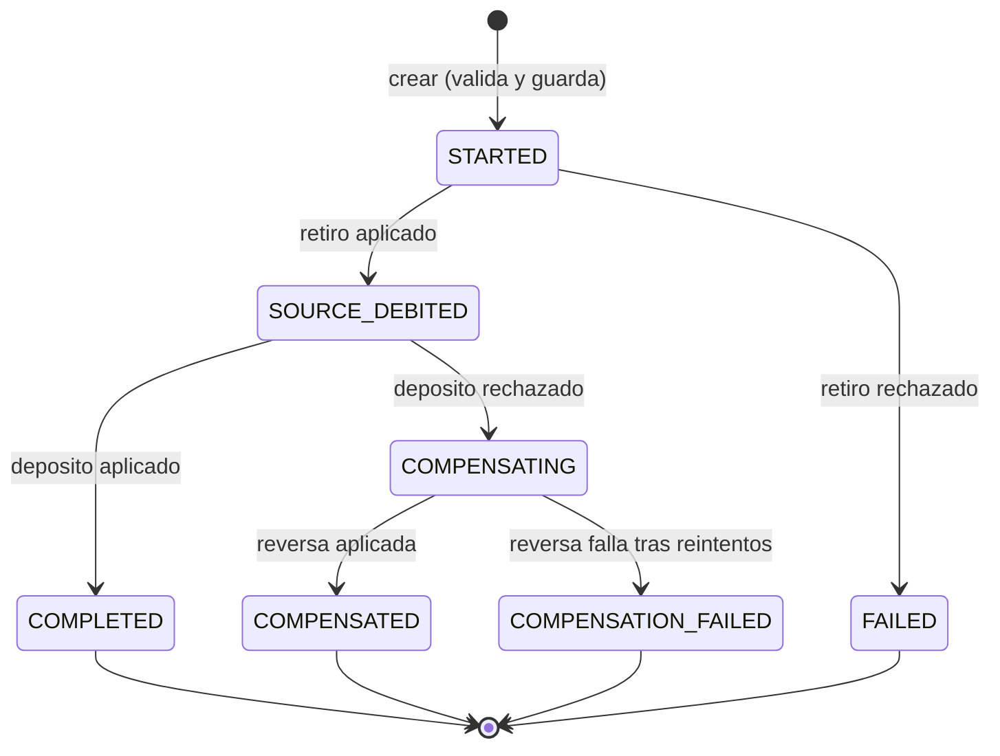
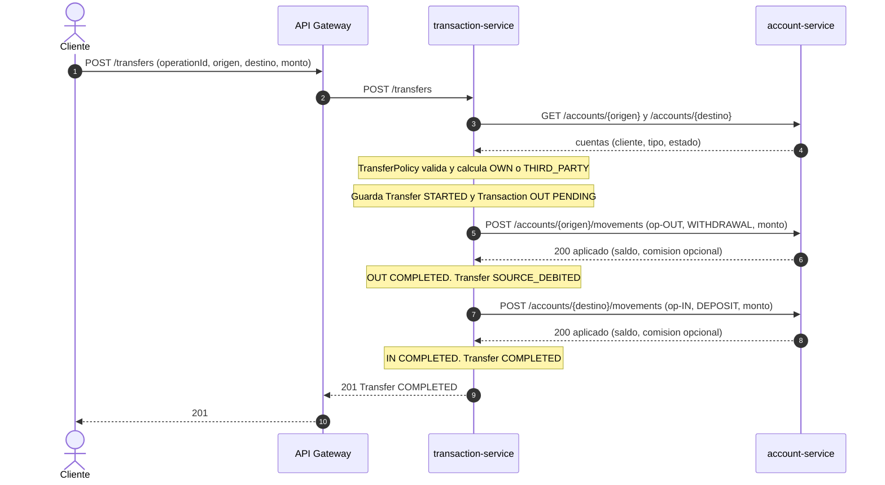
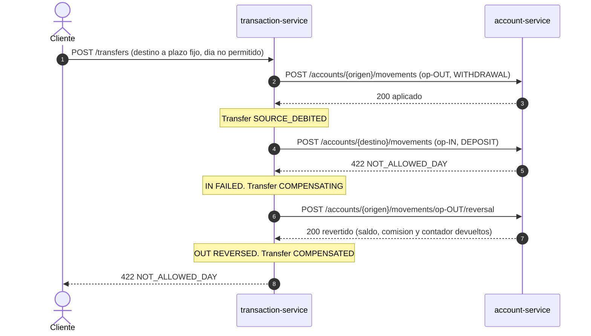
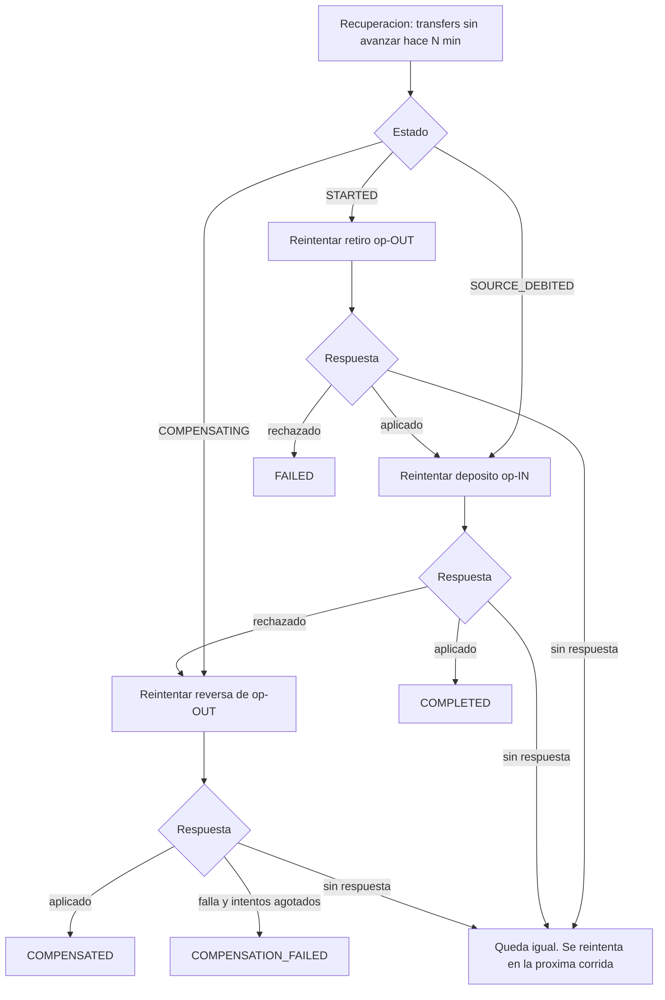
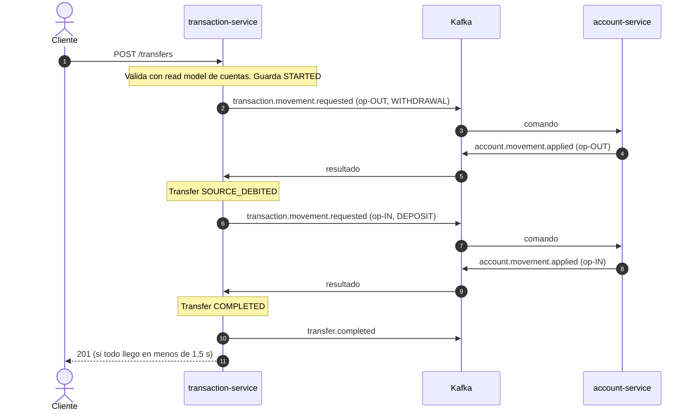
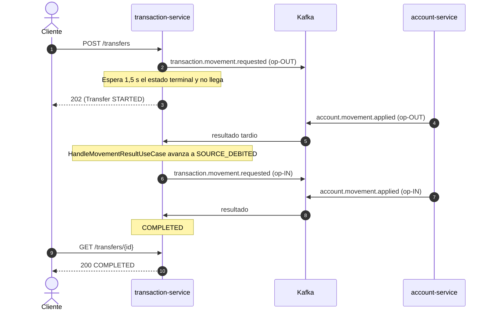

# Flujo 01 — Transferencia entre cuentas

> Saga **orquestada** por `transaction-service`. Participante: `account-service`.
> Cubre RF-33 (Parte II). Se implementa primero por REST (P2) y se migra a Kafka (P3) cambiando solo el adaptador `AccountMovementPort`.
> Fichas relacionadas: `services/transaction-service.md` (aggregate `Transfer`) y `services/account-service.md` (`ApplyMovementUseCase`, `ReverseMovementUseCase`).

## 1. Resumen

| Campo | Valor |
|---|---|
| Disparador | `POST /api/v1/transfers` |
| Orquestador | `transaction-service` (aggregate `Transfer` = máquina de estados) |
| Participante | `account-service` (aplica y revierte movimientos sobre el saldo) |
| Pasos | 1) retirar del origen → 2) depositar en el destino → 3) si el paso 2 es rechazado, revertir el paso 1 |
| Tipos | `OWN` (mismo cliente) y `THIRD_PARTY`. El flujo es idéntico; solo cambia la validación de permisos |
| Fases | P2: llamadas REST con circuit breaker. P3: comandos y resultados por Kafka |
| Resultado | `COMPLETED`, `FAILED`, `COMPENSATED` o `COMPENSATION_FAILED` |

**Principio:** cada cuenta aplica **sus propias reglas** a su pata (límite mensual, día del plazo fijo, comisiones, saldo). El orquestador no las conoce: solo reacciona a "aplicado" o "rechazado con motivo".

## 2. Contrato de entrada

`POST /api/v1/transfers`

```json
{
  "operationId": "b7f0c2a4-...",
  "sourceAccountId": "acc-001",
  "targetAccountId": "acc-002",
  "amount": 150.00,
  "description": "Pago de alquiler"
}
```

Validaciones previas (antes de crear la saga, con `TransferPolicy` y `AccountLookupPort`): monto > 0, origen ≠ destino, ambas cuentas existen y están activas, `CUSTOMER` solo desde una cuenta propia.

Identificadores derivados (todos idempotentes):

| Id | Se usa como `operationId` de | Registro en el historial |
|---|---|---|
| `<op>` | La transferencia (índice único en `transfers`) | — |
| `<op>-OUT` | Retiro en el origen | `Transaction` `TRANSFER_OUT` |
| `<op>-OUT-FEE` | Comisión cobrada al retirar (si la hay) | `Transaction` `FEE` |
| `<op>-IN` | Depósito en el destino | `Transaction` `TRANSFER_IN` |
| `<op>-IN-FEE` | Comisión cobrada al depositar (si la hay) | `Transaction` `FEE` |
| `<op>-REV` | Reversa del retiro (compensación) | Marca `<op>-OUT` como `REVERSED` |

> La reversa en `account-service` se pide sobre la operación original: `POST /accounts/{id}/movements/{op}-OUT/reversal`. `<op>-REV` identifica el intento de compensación en `transaction-service`.

## 3. Estados de `Transfer`



| Estado | Significa | ¿Terminal? | Qué hace la recuperación |
|---|---|---|---|
| `STARTED` | Creada; el retiro se pidió o está por pedirse | No | Reintenta el retiro con `<op>-OUT` |
| `SOURCE_DEBITED` | Retiro aplicado; falta el depósito | No | Reintenta el depósito con `<op>-IN` |
| `COMPENSATING` | Depósito rechazado; falta devolver el retiro | No | Reintenta la reversa (máx. N intentos) |
| `COMPLETED` | Ambas patas aplicadas | Sí | — |
| `FAILED` | El retiro fue rechazado: no se movió dinero | Sí | — |
| `COMPENSATED` | El depósito fue rechazado y el retiro se devolvió | Sí | — |
| `COMPENSATION_FAILED` | No se pudo devolver el retiro | Sí (revisión manual) | Nada; queda listado para el `ADMIN` |

Cada transición se guarda con control optimista (`version`). Una transición que no corresponde al estado actual se **ignora** (mensaje duplicado o tardío).

## 4. Camino feliz (P2, REST)



Reglas del camino:
- Si una cuenta informa comisión, se guarda un movimiento `FEE` enlazado (`parentTransactionId`).
- El estado se guarda **antes** de cada llamada (para poder recuperarse) y **después** de cada respuesta.
- El origen paga monto + comisión; la comisión del destino, si existe, se descuenta del destino.

## 5. Compensación (P2, REST)

El depósito es rechazado (por ejemplo `NOT_ALLOWED_DAY` en una cuenta a plazo fijo). Es el caso de la demo (paso 14).



Resultado observable: el saldo del origen vuelve al valor inicial, el historial muestra `TRANSFER_OUT` en `REVERSED` y `TRANSFER_IN` en `FAILED`, y la transferencia queda `COMPENSATED`.

Retiro rechazado (paso 1): la transferencia queda `FAILED`, `OUT` queda `FAILED`, **no se crea** `IN` y no hay nada que compensar. Respuesta: 422 con el motivo (`INSUFFICIENT_FUNDS`, `NOT_ALLOWED_DAY`, `MONTHLY_LIMIT_EXCEEDED`, `ACCOUNT_INACTIVE`).

## 6. Fallos y recuperación

Regla de oro: **una respuesta perdida no es un rechazo.** Si `account-service` no responde a tiempo (2 s), el orquestador no sabe si el movimiento se aplicó. Por eso **reintenta la misma pata con el mismo `operationId`**: `account-service` devuelve el resultado original (aplicado o rechazado) sin duplicar.

| # | Situación | Estado | Qué hace el orquestador |
|---|---|---|---|
| 1 | Sin respuesta al pedir el **retiro** | `STARTED` | Responde 202. La recuperación reintenta `<op>-OUT` hasta tener respuesta definitiva |
| 2 | Sin respuesta al pedir el **depósito** | `SOURCE_DEBITED` | Responde 202. Reintenta `<op>-IN`. **No compensa**: si el depósito se aplicó pero la respuesta se perdió, compensar duplicaría el dinero |
| 3 | Depósito **rechazado** | `SOURCE_DEBITED` → `COMPENSATING` | Pide la reversa de `<op>-OUT` |
| 4 | Sin respuesta a la **reversa** | `COMPENSATING` | Reintenta la reversa (idempotente) |
| 5 | La reversa falla tras N intentos | `COMPENSATION_FAILED` | Publica `TransferFailed`. Revisión manual del `ADMIN` |
| 6 | `transaction-service` cae a mitad | El último estado guardado | Al volver, la recuperación toma las transferencias sin avanzar hace más de N minutos y continúa según su estado |
| 7 | El cliente repite la petición | Cualquiera | Se devuelve el estado actual por `operationId`, sin crear otra |

**Recuperación** (`RecoverPendingOperationsUseCase`): proceso `@Scheduled` y `POST /transaction-recovery-runs`. Busca `transfers` en `STARTED`, `SOURCE_DEBITED` o `COMPENSATING` con `updatedAt` anterior a N minutos y las hace avanzar con la misma función que usa el camino normal. Cada intento incrementa `compensationAttempts` (solo en `COMPENSATING`).



## 7. Versión P3 (Kafka)

`transaction-service` envía un **comando** y `account-service` responde con un **evento**. Los casos de uso no cambian: solo el adaptador de `AccountMovementPort`.

### 7.1 Quién avanza la saga

- La petición HTTP valida, guarda la transferencia en `STARTED`, envía el primer comando y **solo espera** (hasta 1,5 s, en memoria) a que la transferencia llegue a un estado terminal.
- **El consumidor de resultados es el único que avanza la saga** (`HandleMovementResultUseCase`): guarda la transición, envía el siguiente comando (o la compensación) y avisa a la espera.
- Si el estado terminal llega a tiempo, la petición responde 201 (o 422 si terminó en rechazo). Si no (1,5 s, o el resultado cae en otra instancia), responde **202** y la saga termina igual.
- Hay un solo escritor por transición, así que no hay carreras entre la petición y el consumidor. El consumidor confirma el mensaje solo **después** de guardar; el estado con `version` evita dobles transiciones.
- En **P2** (REST) no hay consumidor: avanza la propia petición, llamando a `account-service` paso a paso, con la **misma función de avance**.

Así la saga siempre termina aunque el cliente ya no esté esperando, y la espera de 1,5 s es solo una comodidad para responder 201 en el caso normal. La regla es común a `transaction`, `debit` y `yanki` (ver `flows/03-yanki-payment.md`, sección 5).



Si el tiempo se agota:



### 7.2 Mensajes (borrador; el contrato definitivo se cierra en el documento de Kafka)

Sobre común de todos los mensajes:

```json
{
  "eventId": "uuid",
  "eventType": "transaction.movement.requested",
  "occurredAt": "2026-09-23T17:45:00Z",
  "correlationId": "<operationId de la pata>",
  "payload": { }
}
```

| Tópico | Emisor → Receptor | Clave | `payload` |
|---|---|---|---|
| `transaction.movement.requested` | transaction → account | `accountId` | `operationId`, `accountId`, `type` (`DEPOSIT`/`WITHDRAWAL`), `amount`, `date` |
| `transaction.movement.reversal.requested` | transaction → account | `accountId` | `operationId` (el de la operación a revertir), `accountId` |
| `account.movement.applied` | account → transaction | `accountId` | `operationId`, `accountId`, `type`, `amount`, `fee`, `newBalance` |
| `account.movement.rejected` | account → transaction | `accountId` | `operationId`, `accountId`, `reasonCode` |
| `account.movement.reversed` | account → transaction | `accountId` | `operationId`, `accountId`, `newBalance` |
| `transfer.completed` / `transfer.failed` | transaction → (trazabilidad) | `transferId` | `transferId`, `status`, `sourceAccountId`, `targetAccountId`, `amount`, `reasonCode` |

Reglas de mensajería:
- Clave = `accountId`: los movimientos de una misma cuenta se procesan en orden.
- Consumidores idempotentes: un comando repetido devuelve el mismo resultado (`account_operations`); un resultado repetido se ignora por estado.
- Un resultado de una pata que no corresponde al estado de la transferencia se descarta y se registra en el log.

## 8. Qué ve el cliente

| Situación | Respuesta |
|---|---|
| Transferencia completada a tiempo | 201 con la transferencia `COMPLETED` |
| Sigue en proceso | 202 con la transferencia (`STARTED`, `SOURCE_DEBITED` o `COMPENSATING`); consultar `GET /transfers/{id}` |
| Retiro rechazado | 422 con el motivo. Estado `FAILED` |
| Depósito rechazado y devuelto | 422 con el motivo del depósito. Estado `COMPENSATED` |
| No se pudo devolver | 202 y luego, al consultar, `COMPENSATION_FAILED`. Detalle para el `ADMIN` |
| Repetición con el mismo `operationId` | Mismo resultado (200 si ya terminó; 422 idéntico si terminó en rechazo) |
| Validación previa (misma cuenta, cuenta inexistente, monto inválido) | 400 o 404, sin crear la saga |

## 9. Pruebas del flujo

| # | Caso | Verificación |
|---|---|---|
| 1 | Transferencia `OWN` feliz | Saldos: origen − monto, destino + monto. `COMPLETED`. Dos movimientos en el historial |
| 2 | Transferencia `THIRD_PARTY` feliz | Igual, con `kind=THIRD_PARTY` |
| 3 | Con comisión en el origen (más de 5 transacciones libres) | Movimiento `FEE` enlazado; el origen baja monto + comisión |
| 4 | Retiro rechazado por saldo | `FAILED`; no existe `IN`; los saldos no cambian |
| 5 | Depósito rechazado (plazo fijo, día no permitido) | `COMPENSATED`; saldo del origen igual al inicial; `OUT` en `REVERSED`, `IN` en `FAILED` |
| 6 | Repetir `operationId` en cada estado | No se crean otros movimientos ni otra transferencia |
| 7 | Timeout del retiro | 202; la recuperación termina la saga sin duplicar |
| 8 | Timeout del depósito con el depósito ya aplicado | La recuperación obtiene el resultado original y llega a `COMPLETED`; **no** revierte |
| 9 | Falla del orquestador tras `SOURCE_DEBITED` | Al volver, continúa con el depósito |
| 10 | Reversa que falla N veces | `COMPENSATION_FAILED` y evento `transfer.failed` |
| 11 | Resultado duplicado o fuera de orden (P3) | Se ignora; sin cambio de estado |
| 12 | Circuit breaker abierto en `account-service` | 503 antes de crear la saga; si ya existía, queda pendiente |

## 10. Decisiones y pendientes

**Decidido**
- Saga orquestada por `transaction-service`; la lógica de avance es una sola función usada por el camino REST, el consumidor de Kafka y la recuperación.
- Ante un timeout **no se compensa**: se reintenta la misma pata hasta tener respuesta definitiva.
- En P3 el consumidor de resultados es el único que avanza la saga; la petición solo espera el estado terminal (1,5 s) y, si no llega, responde 202.
- Las comisiones se registran como movimientos aparte; la reversa devuelve saldo, comisión y contador de movimientos.
- **Al compensar (P3), `transaction-service` publica `transaction.reversed`** del retiro y revierte su comisión `<op>-OUT-FEE`, para que `report-service` deje de mostrarlos (definido en `contracts/transaction-service/data-model.md`).

**Cambios que este flujo pide a las fichas**
- `transaction-service`: `Transfer` agrega `compensationAttempts`; `GET /transfers` agrega el filtro `operationId`; la comisión lleva la id `<pata>-FEE` (ya aplicada en la ficha).
- `account-service`: la **reversa debe aplicarse aunque la cuenta esté `INACTIVE`** (compensar es devolver dinero, no operar); si la cuenta se cerró, la reversa falla y termina en `COMPENSATION_FAILED`.

**Pendiente**
- Máximo de intentos de reversa y minutos de "sin avanzar" (parámetros en Config Server; propuesta inicial: 5 intentos y 2 minutos).
- Reversa de un depósito ya gastado (no aplica a transferencias, sí a Yanki: ver flujo 03).
- Qué ocurre con un retiro reintentado indefinidamente si `account-service` no vuelve: hoy se reintenta sin límite y queda visible en `GET /transfers?status=STARTED`.
- Outbox para publicar `transfer.*` (común a todos los flujos).
