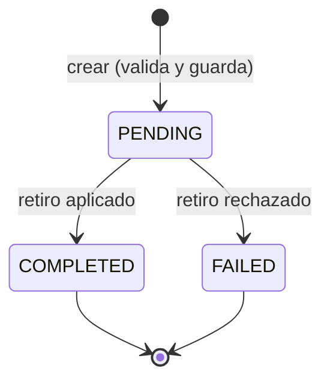
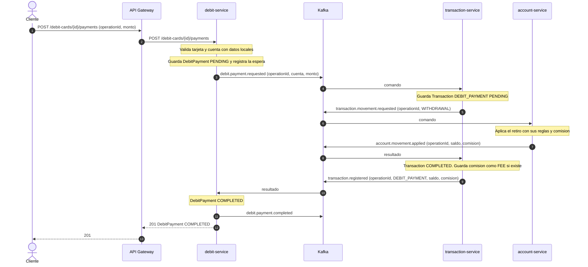
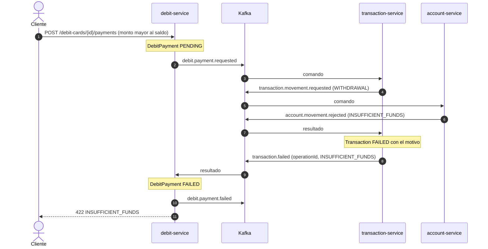
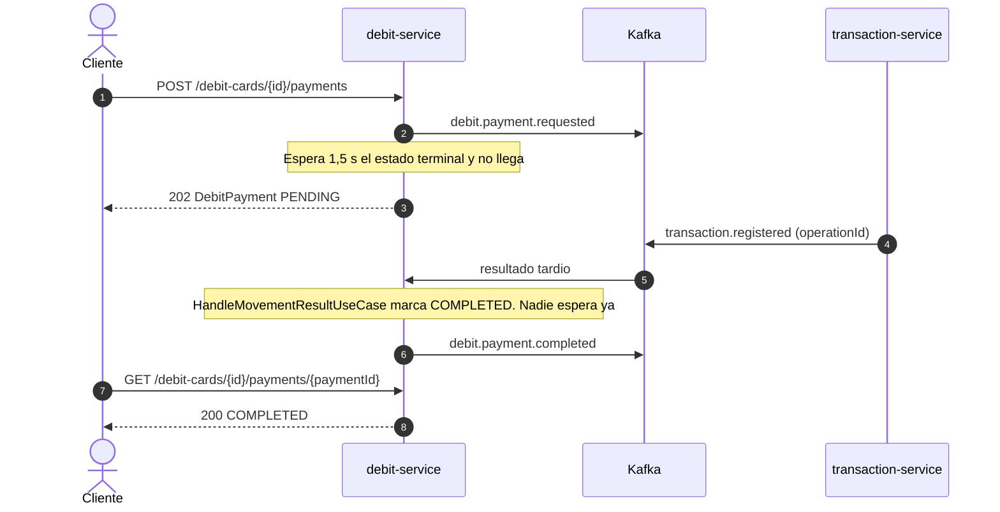
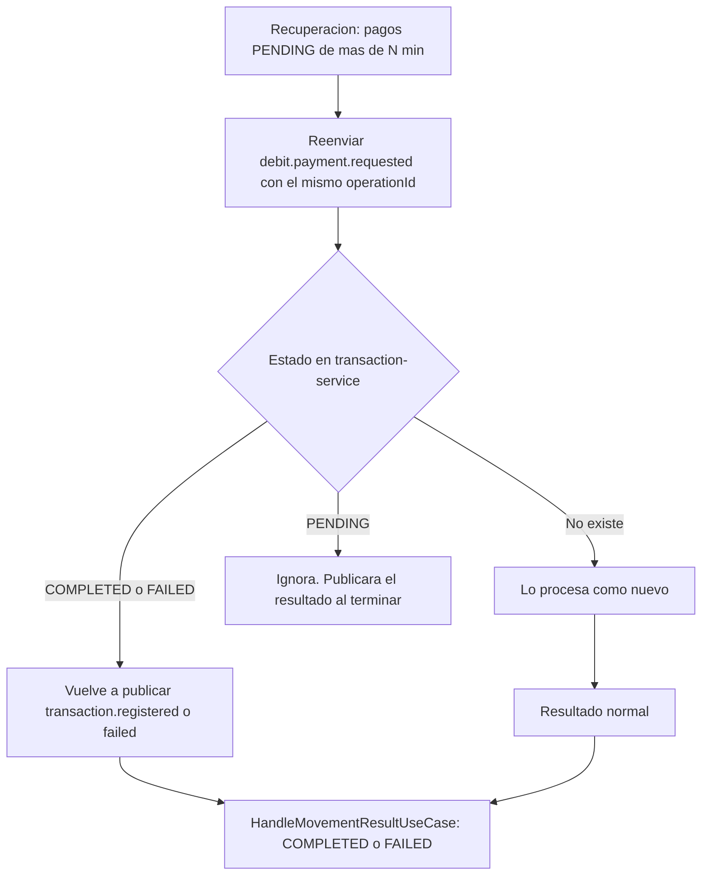

# Flujo 02 — Pago con tarjeta de débito

> Saga orquestada de **un solo paso** por `debit-service`. Ejecutan el retiro `transaction-service` y `account-service`.
> Cubre RF-51 (Parte III). Solo existe en P3: **todo por Kafka, sin REST entre servicios**.
> Fichas relacionadas: `services/debit-service.md` (`DebitPayment`), `services/transaction-service.md`, `services/account-service.md`.
> Patrones comunes (espera de 1,5 s, quién avanza, recuperación): ver `flows/01-transfer.md`, secciones 6 y 7.

## 1. Resumen

| Campo | Valor |
|---|---|
| Disparador | `POST /api/v1/debit-cards/{id}/payments` |
| Orquestador | `debit-service` (aggregate `DebitPayment` = estado de la saga) |
| Participantes | `transaction-service` (registra el retiro y lo pide a la cuenta) → `account-service` (aplica el retiro) |
| Pasos | 1) retirar de la cuenta principal (o de la asociada indicada). **No hay paso 2**, por eso no hay compensación |
| Resultado | `COMPLETED` o `FAILED` |
| Bloqueos | La deuda vencida **no** impide pagar (RF-60 solo bloquea adquirir productos) |

**Por qué no hay compensación:** el único efecto es el retiro. Si se rechaza, no se movió nada; si se aplica, el pago está hecho. Lo que puede fallar es la comunicación (mensajes perdidos), y eso lo resuelven la **idempotencia por `operationId`** y la **recuperación**.

Los pagos completados no se devuelven (no hay reembolsos en el alcance del demo).

## 2. Contrato de entrada

`POST /api/v1/debit-cards/{id}/payments`

```json
{
  "operationId": "3c1e9b52-...",
  "amount": 45.90,
  "description": "Compra en bodega",
  "accountId": "acc-002"
}
```

`accountId` es opcional: si falta se usa la cuenta principal de la tarjeta.

**Validaciones antes de crear el pago** (con datos propios y read models, sin llamar a nadie):

| Validación | Fuente | Error |
|---|---|---|
| La tarjeta existe y pertenece al usuario (`CUSTOMER`) | `debit_cards` | 404 / 403 |
| La tarjeta está activa y no vencida | `DebitCard.assertUsable(date)` | 422 `CARD_NOT_USABLE` |
| El cliente sigue `ACTIVE` (copia local) | `customer_snapshots` | 422 `CUSTOMER_INACTIVE` |
| Monto > 0 | `Money` | 400 |
| La cuenta indicada está asociada a la tarjeta | `LinkedAccounts` | 422 `ACCOUNT_NOT_ELIGIBLE` |

Las reglas de saldo, límite mensual y comisión **no** se validan aquí: las aplica `account-service` (fuente de verdad) y se conocen en el resultado.

Identificador: el `operationId` del cliente se usa **tal cual** para el pago, para el registro en `transaction-service` (`DEBIT_PAYMENT`) y para el retiro en `account-service`. Es un solo paso, no hay sufijos de pata. Debe medir entre 8 y 56 caracteres (`transaction-service` agrega `-FEE` a la comisión) y conviene que sea un UUID para no chocar con operaciones de otros endpoints. Mismo `operationId` con otra tarjeta, monto o cuenta → 409 `OPERATION_ID_REUSED`.

## 3. Estados de `DebitPayment`



| Estado | Significa | Qué hace la recuperación |
|---|---|---|
| `PENDING` | Comando enviado; falta el resultado | Reenvía el mismo comando (mismo `operationId`) tras N minutos |
| `COMPLETED` | Retiro registrado y aplicado | — |
| `FAILED` | Retiro rechazado, con `failureReason` | — |

Una transición que no corresponde (resultado repetido o tardío sobre un pago ya terminado) se **ignora**.

## 4. Camino feliz



Notas:
- **Dos saltos, un solo dueño:** `debit-service` no habla con `account-service`. Pide a `transaction-service` (única puerta para mover saldo de cuentas) y este pide a la cuenta. El resultado vuelve por el mismo camino, correlacionado por `operationId`.
- La espera del cliente es de **hasta 1,5 s** en total. Son cuatro saltos de Kafka; si el entorno es lento, es normal responder 202.
- Si la cuenta cobra comisión (más de 5 transacciones libres), el saldo resultante ya la descuenta. `transaction-service` la guarda como movimiento `FEE` aparte y la informa en el resultado.

## 5. Pago rechazado

Caso típico: saldo insuficiente (demo, paso 29).



Motivos que llegan desde la cuenta: `INSUFFICIENT_FUNDS`, `MONTHLY_LIMIT_EXCEEDED`, `ACCOUNT_INACTIVE`, `INVALID_AMOUNT`. Se conservan en `failureReason` y se devuelven tal cual.

## 6. Respuesta tardía (202)

Igual que en el flujo 01: la petición espera hasta 1,5 s; si no llega el resultado, responde **202** y el pago sigue `PENDING`.



Regla de quién guarda el resultado (común a los tres orquestadores, ver `flows/03-yanki-payment.md`, sección 5): **siempre lo guarda el consumidor** (`HandleMovementResultUseCase`), que después avisa a la espera en memoria. La petición solo espera el estado terminal. Hay un único escritor, así que no hay carreras.

## 7. Fallos y recuperación

| # | Situación | Estado | Qué ocurre |
|---|---|---|---|
| 1 | Se pierde el comando `debit.payment.requested` | `PENDING` | La recuperación lo reenvía tras N minutos con el mismo `operationId` |
| 2 | Se pierde la respuesta (`transaction.registered/failed`) | `PENDING` | La recuperación reenvía el comando. `transaction-service` **vuelve a publicar el resultado** que ya tiene (ver 8) |
| 3 | `debit-service` cae tras aplicar el resultado pero antes de guardarlo | `PENDING` | Igual que 2: al reenviar, llega otra vez el resultado y se guarda |
| 4 | `transaction-service` o `account-service` caídos | `PENDING` | Los comandos quedan en Kafka y se procesan al volver. El cliente ya recibió 202 |
| 5 | Resultado repetido o fuera de orden | Cualquiera | Se ignora si el pago ya es terminal |
| 6 | El cliente repite con el mismo `operationId` | Cualquiera | Se devuelve el estado actual (200 si `COMPLETED`, 422 con el mismo código si `FAILED`). Si sigue `PENDING`, se **vuelve a pedir el retiro** y se espera otros 2 s: si termina, 200 o 422; si no, 202 |

**Recuperación** (`RecoverPendingPaymentsUseCase`): `@Scheduled` y `POST /debit-payment-recovery-runs`. Busca `debit_payments` `PENDING` con `requestedAt` anterior a N minutos y reenvía `debit.payment.requested`. Nunca crea un pago nuevo.



## 8. Mensajes (borrador; contrato definitivo en el documento de Kafka)

Sobre común: el definido en el flujo 01 (`eventId`, `eventType`, `occurredAt`, `correlationId` = `operationId`, `payload`).

| Tópico | Emisor → Receptor | Clave | `payload` |
|---|---|---|---|
| `debit.payment.requested` | debit → transaction | `accountId` | `operationId`, `paymentId`, `cardId`, `customerId`, `accountId`, `amount`, `description`, `requestedAt` |
| `transaction.movement.requested` | transaction → account | `accountId` | `operationId`, `accountId`, `type=WITHDRAWAL`, `amount`, `date` |
| `account.movement.applied` / `rejected` | account → transaction | `accountId` | Ver flujo 01 |
| `transaction.registered` | transaction → debit (también yanki, report) | `productId` | `transactionId`, `operationId`, `productId`, `type=DEBIT_PAYMENT`, `customerId`, `amount`, `fee`, `resultingBalance`, `occurredAt` |
| `transaction.failed` | transaction → debit | `productId` | `transactionId`, `operationId`, `productId`, `type=DEBIT_PAYMENT`, `reasonCode` |
| `debit.payment.completed` | debit → report | `cardId` | `paymentId`, `cardId`, `customerId`, `accountId`, `amount`, `fee`, `description`, `resultingBalance`, `occurredAt` |
| `debit.payment.failed` | debit → (trazabilidad) | `cardId` | `paymentId`, `cardId`, `reasonCode` |

Reglas:
- **Filtro del consumidor:** `debit-service` solo procesa `transaction.registered/failed` de tipo `DEBIT_PAYMENT` cuyo `operationId` corresponde a uno de sus pagos; el resto se descarta.
- **`transaction-service` es idempotente con reenvío:** si recibe `debit.payment.requested` de una `operationId` ya conocida, **no crea otro registro** y, si ya terminó, vuelve a publicar su resultado. Sin esto la recuperación no podría cerrar un pago cuyo resultado se perdió.
- **Entrega al menos una vez:** el consumidor confirma el mensaje (commit del offset) **después** de guardar. Los duplicados son inofensivos por las reglas anteriores.
- **Autorización:** los mensajes internos no llevan token. Que el usuario sea dueño de la tarjeta se valida en `debit-service`, antes de crear el pago.

## 9. Qué ve el cliente

| Situación | Respuesta |
|---|---|
| Pago completado a tiempo | 201 con el pago `COMPLETED` (incluye `resultingBalance`) |
| Sin resultado en 1,5 s | 202 con el pago `PENDING`; consultar `GET /debit-cards/{id}/payments/{paymentId}` |
| Rechazado por la cuenta | 422 con el motivo. Pago `FAILED` |
| Tarjeta cerrada o vencida, cuenta no asociada | 422 sin crear el pago |
| Repetición con el mismo `operationId` | Estado actual (200, 422 idéntico o 202; si estaba `PENDING`, reenvía el pedido y espera de nuevo) |

## 10. Pruebas del flujo

| # | Caso | Verificación |
|---|---|---|
| 1 | Pago feliz con la cuenta principal | 201. Saldo de la cuenta − monto. `DebitPayment` `COMPLETED`. Movimiento `DEBIT_PAYMENT` en el historial de la cuenta |
| 2 | Pago a otra cuenta asociada (`accountId`) | Se descuenta esa cuenta y no la principal |
| 3 | Cuenta no asociada a la tarjeta | 422 `ACCOUNT_NOT_ELIGIBLE`; no se crea el pago |
| 4 | Saldo insuficiente | 422; pago `FAILED`; saldo sin cambios; movimiento `FAILED` en el historial |
| 5 | Más de 5 transacciones libres | Movimiento `FEE` enlazado; el pago informa la comisión |
| 6 | Repetir el `operationId` en cada estado | Sin doble cargo ni segundo pago |
| 7 | Resultado que llega tras el 202 | Pago `COMPLETED` sin intervención del cliente |
| 8 | Resultado perdido | La recuperación reenvía y el pago queda cerrado; sin doble cargo |
| 9 | Resultado duplicado o desordenado | Se ignora; sin cambio |
| 10 | Resultado de otro tipo o `operationId` desconocido | Se descarta |
| 11 | Tarjeta cerrada por cierre de su única cuenta | 422 `CARD_NOT_USABLE` |
| 12 | Cliente con deuda vencida | **Sí puede pagar** (RF-60 no lo bloquea) |
| 13 | `CUSTOMER` con tarjeta de otro | 403 |

> **Contrato exacto:** `contracts/debit-service/` (`openapi.yaml`, `data-model.md`). Precisiones sobre este flujo: 201 solo para quien crea el pago (toda repetición de un `COMPLETED` es 200); la idempotencia se evalúa antes que la validez de la tarjeta; un cliente `INACTIVE` no puede pagar; la recuperación tiene un tope de reenvíos (`debit.recovery.max-attempts`); `completedAt` y el `occurredAt` de `debit.payment.completed` son los del movimiento de `transaction-service`.

## 11. Decisiones y pendientes

**Decidido**
- Saga de un solo paso: sin compensación. La recuperación reenvía el mismo comando.
- `debit-service` **no** pide movimientos a `account-service`: pasa por `transaction-service`. Solo `transaction-service` mueve saldo de cuentas.
- Un `operationId` para todo el camino (pago, historial y retiro).
- `transaction-service` reemite el resultado ante un comando repetido.
- Las validaciones del cliente y la tarjeta se hacen con datos locales; las de saldo y comisión, en la cuenta.
- La deuda vencida no bloquea los pagos con tarjeta.

**Cambios que este flujo pide a las fichas**
- `transaction-service`:
  - Agregar el caso de uso `RecordRequestedMovementUseCase`: consume `debit.payment.requested` (y, después, `yanki.movement.requested`), crea el movimiento de tipo `DEBIT_PAYMENT`, y es idempotente con **reemisión del resultado** (regla 8).
  - `TransactionRegistered` agrega `fee` (opcional).
- `debit-service`:
  - `DebitPayment` agrega `fee` y `DebitPaymentCompleted` lo incluye.
  - `GET /debit-cards/{id}/payments` agrega los filtros `status` y `operationId`. El reporte de "últimos 10 movimientos" usa `status=COMPLETED`; el filtro por `operationId` permite encontrar un pago rechazado tras el 422.

**Pendiente**
- Minutos para considerar pendiente un pago (propuesta: 2, igual que en el flujo 01).
- Límite diario de pagos y reembolsos: fuera de alcance.
- Espera en memoria con varias instancias: el resultado puede caer en otra y el cliente verá 202 (aceptado para el demo).
- Outbox para publicar `debit.payment.*` (común a todos los flujos).
