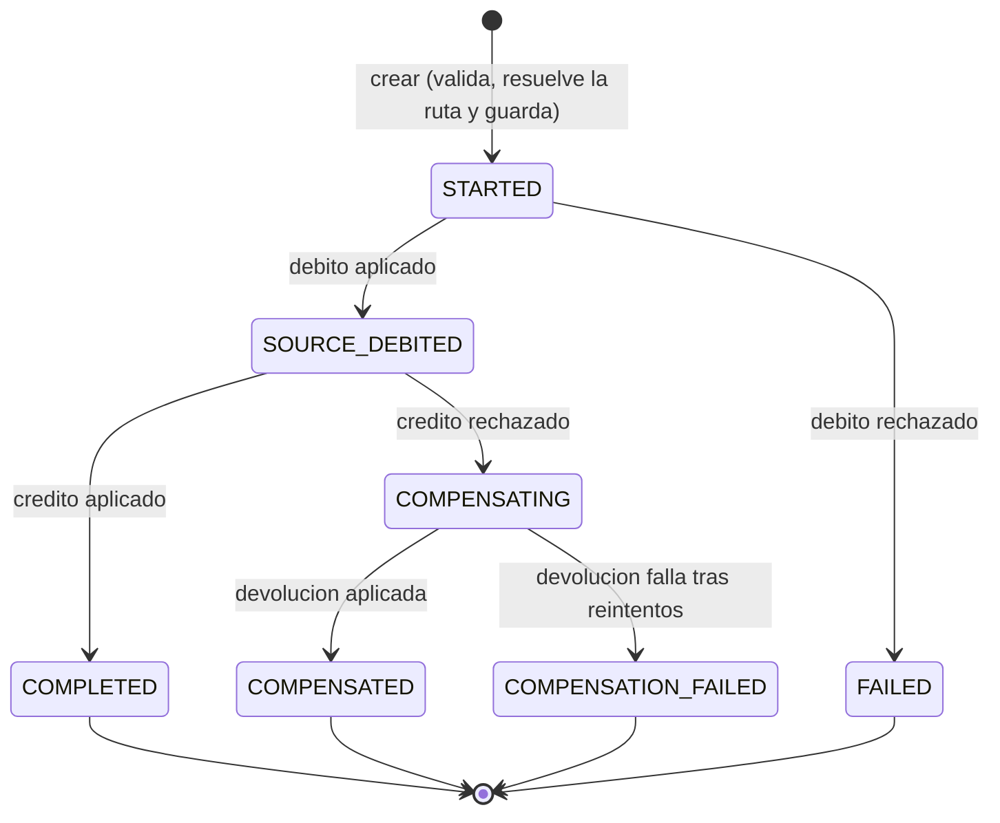
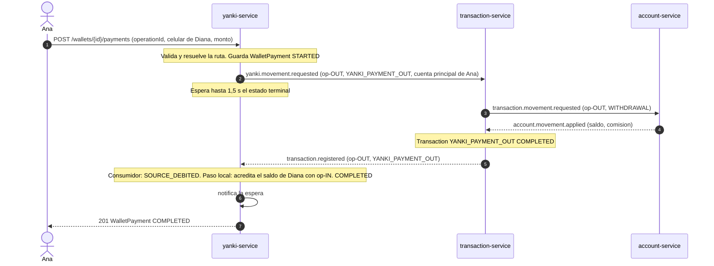
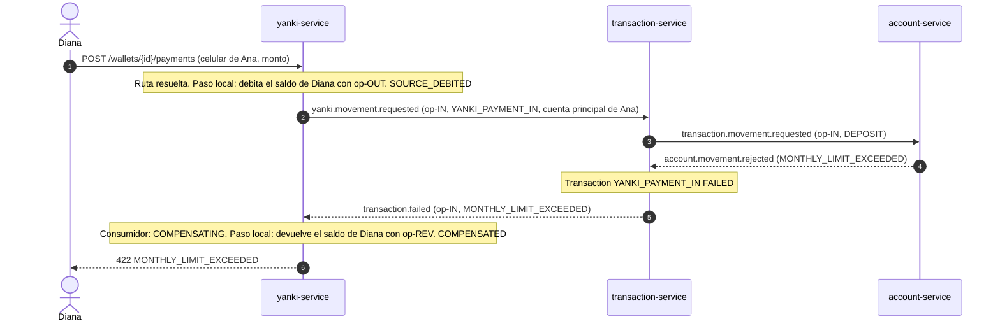
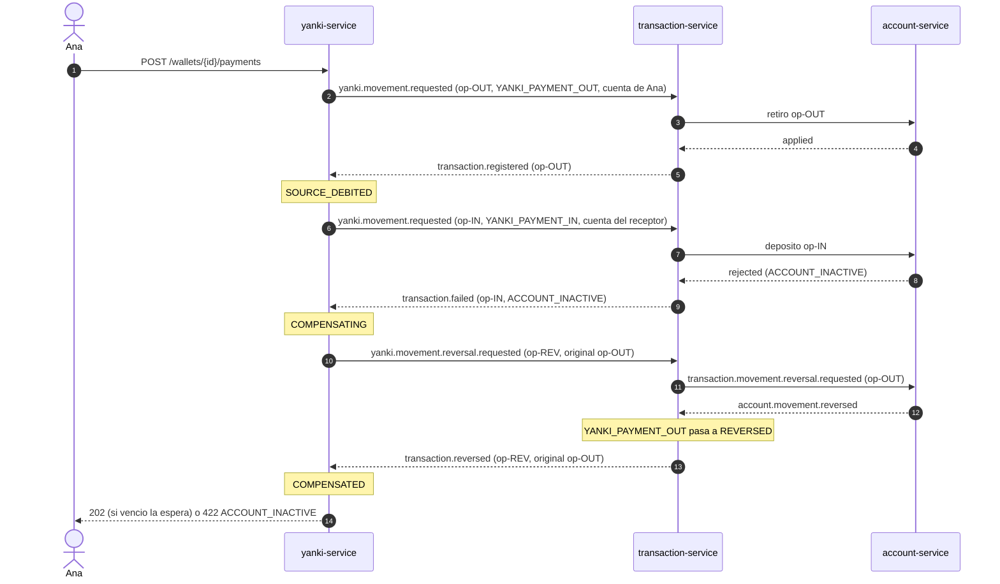
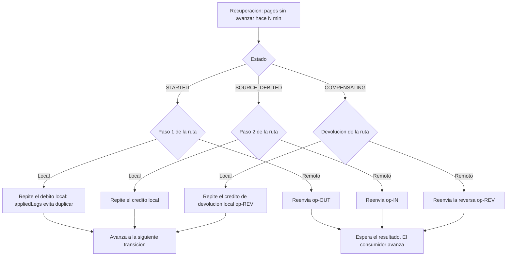

# Flujo 03 — Pago Yanki por número de celular

> Saga **orquestada** por `yanki-service`. Sus pasos pueden ser **locales** (saldo del monedero) o **remotos** (cuentas bancarias, a través de `transaction-service` y `account-service`).
> Cubre RF-70 a RF-73 (Parte III). Solo existe en P3: **todo por Kafka, sin REST entre servicios**.
> Fichas relacionadas: `services/yanki-service.md`, `services/transaction-service.md`, `services/account-service.md`, `services/debit-service.md` (cuenta principal de la tarjeta).
> Patrones comunes (estados, recuperación, mensajes, espera de 1,5 s): `flows/01-transfer.md` y `flows/02-debit-payment.md`.
> Contratos definitivos: `contracts/yanki-service/openapi.yaml` y `data-model.md` (sección 3: algoritmo de la saga) y `contracts/events/kafka-contract.md`. Si algo difiere de este flujo, mandan los contratos.

## 1. Resumen

| Campo | Valor |
|---|---|
| Disparador | `POST /api/v1/wallets/{id}/payments` |
| Orquestador | `yanki-service` (aggregate `WalletPayment` = estado de la saga; `PaymentSagaCoordinator`) |
| Participantes | `transaction-service` → `account-service` (solo cuando el origen o el destino es una cuenta) |
| Pasos | 1) debitar al emisor → 2) acreditar al receptor → 3) si el paso 2 es rechazado, devolver el paso 1 |
| Resultado | `COMPLETED`, `FAILED`, `COMPENSATED` o `COMPENSATION_FAILED` |
| Bloqueos | La deuda vencida no aplica a Yanki (RF-60 no cubre monederos; ver pendientes de la ficha) |

**Idea clave:** cada monedero tiene dos modos.
- **Independiente:** tiene saldo propio. Debitar o acreditar es una operación **local** en `wallets`.
- **Asociado a una tarjeta:** no tiene saldo propio; usa la **cuenta principal** de la tarjeta. Debitar o acreditar es una operación **remota** sobre la cuenta bancaria.

Por eso hay **cuatro combinaciones** de una misma saga.

## 2. Contrato de entrada

`POST /api/v1/wallets/{id}/payments`

```json
{
  "operationId": "9d2a7f10-...",
  "receiverPhone": "987654321",
  "amount": 30.00,
  "description": "Almuerzo"
}
```

El emisor es el monedero `{id}` (solo su dueño puede pagar). El receptor se identifica **solo por celular**.

**Validaciones antes de crear la saga** (datos propios y read models, sin llamar a nadie):

| Validación | Error |
|---|---|
| El monedero es del usuario del token y está `ACTIVE` | 403 / 422 `WALLET_INACTIVE` |
| Monto > 0 | 400 |
| Existe un monedero `ACTIVE` con ese celular | 422 `RECEIVER_NOT_FOUND` |
| Emisor ≠ receptor | 422 `SAME_WALLET` |
| Si el emisor es independiente: saldo suficiente | 422 `INSUFFICIENT_FUNDS` |

Con esto `PaymentRoutingPolicy` **resuelve la ruta** y la guarda en el pago (`PaymentRoute`): tipo de cada extremo y, si es cuenta, su `accountId` (la cuenta principal de la tarjeta según el read model). La ruta **no cambia** durante la saga, aunque luego se cambie la cuenta principal.

Identificadores de las patas (`legId`), usados como `operationId` de cada operación:

| `legId` | Operación | Si es remota, en `transaction-service` |
|---|---|---|
| `<op>-OUT` | Debitar al emisor | `YANKI_PAYMENT_OUT` (retiro) |
| `<op>-IN` | Acreditar al receptor | `YANKI_PAYMENT_IN` (depósito) |
| `<op>-REV` | Devolver al emisor (compensación) | Reversa de `<op>-OUT` |

## 3. Las cuatro rutas

| # | Emisor | Receptor | Paso 1 (OUT) | Paso 2 (IN) | Compensación (si IN es rechazado) |
|---|---|---|---|---|---|
| 1 | Monedero independiente | Monedero independiente | Local | Local | Local |
| 2 | Cuenta principal | Monedero independiente | **Remoto** | Local | Remota |
| 3 | Monedero independiente | Cuenta principal | Local | **Remoto** | Local |
| 4 | Cuenta principal | Cuenta principal | **Remoto** | **Remoto** | Remota |

- **Paso local:** se ejecuta dentro del servicio, sin mensajes. Es idempotente por `legId` (ver sección 6).
- **Paso remoto:** se envía un comando por Kafka y se espera su resultado.
- Solo se compensa el **paso 1**. Cuando el paso 1 es local, la devolución es local e inmediata.

## 4. Estados de `WalletPayment`

Son los mismos que los de la transferencia.



| Estado | Significa | Qué hace la recuperación |
|---|---|---|
| `STARTED` | Creado; el débito se pidió o está por hacerse | Reintenta el débito con `<op>-OUT` |
| `SOURCE_DEBITED` | Emisor debitado; falta acreditar | Reintenta el crédito con `<op>-IN` |
| `COMPENSATING` | Crédito rechazado; falta devolver | Reintenta la devolución con `<op>-REV` |
| `COMPLETED` / `FAILED` / `COMPENSATED` | Terminales | — |
| `COMPENSATION_FAILED` | No se pudo devolver | Nada; revisión manual del `ADMIN` |

Cada transición se guarda con control optimista (`version`). Una transición que no corresponde al estado actual se **ignora**.

## 5. Quién avanza la saga (P3)

Regla común para los tres orquestadores (`transaction`, `debit`, `yanki`) en P3:

1. **La petición HTTP** valida, guarda el pago en `STARTED`, ejecuta lo que pueda hacer en local y envía el primer comando remoto. Luego **solo espera** (hasta 1,5 s) a que el pago llegue a un estado terminal.
2. **El consumidor** de resultados es **el único que avanza** la saga cuando llega una respuesta remota: guarda la transición, ejecuta el siguiente paso (local o remoto) y avisa a la espera en memoria.
3. Si el estado terminal llega a tiempo, la petición responde 201 (o 422 si terminó en rechazo). Si no, responde **202**, y la saga termina igual por el consumidor.

Precisión (contrato): la petición, el consumidor y la recuperación usan la **misma función** `advance(payment)`. Además, repetir una petición con un pago en curso lo retoma (repite el paso local o reenvía el comando remoto, ambos idempotentes) y espera otros 2 s. Las transiciones se guardan con `version`: si otro escritor ya avanzó el pago, la transición propia se **ignora**.

Así hay **un solo escritor** por transición y no hay carreras entre la petición y el consumidor. Un resultado no se pierde aunque la petición haya vencido, porque el consumidor confirma el mensaje solo **después** de guardar el nuevo estado.

> Este modelo reemplaza la descripción "quien recibe el resultado avanza" de los flujos 01 y 02, que ya se actualizaron. En **P2** (REST), como no hay consumidor, avanza la propia petición con la misma función de avance.

Cuando el paso 1 es local y el paso 2 también, todo ocurre dentro de la petición y no interviene Kafka (ruta 1).

## 6. Pasos locales: idempotencia sobre el saldo

Un paso local cambia el saldo del monedero (`wallets`) y el estado del pago (`wallet_payments`) en **dos documentos distintos**, sin transacción entre ellos. Para poder recuperarse ante una caída:

1. Guardar el pago en el estado anterior (`STARTED` o `SOURCE_DEBITED`).
2. Aplicar la operación al monedero: `Wallet.debit(amount, legId)` o `Wallet.credit(amount, legId)`. Si el `legId` ya está en `appliedLegs`, **no se vuelve a aplicar** y se devuelve que ya estaba aplicado. Se guarda con control de versión (reintento por conflicto).
3. Guardar la transición del pago (`SOURCE_DEBITED`, `COMPLETED`, ...).

Si el servicio cae entre 2 y 3, la recuperación repite el paso: el monedero reconoce el `legId` y solo falta guardar la transición. Nunca se cobra dos veces.

`appliedLegs` conserva los últimos 50 `legId` (basta, porque solo importan las operaciones en curso).

## 7. Caminos

Todos los mensajes entre servicios viajan por Kafka; se omite el bróker para simplificar. La clave de los mensajes de cuenta es el `accountId`.

### 7.1 Ruta 2: cuenta → monedero (demo, paso 32)

Ana (monedero asociado a su tarjeta) le paga a Diana (monedero independiente).



Resultado observable: baja el saldo de la cuenta principal de Ana; sube el saldo del monedero de Diana; el pago queda `COMPLETED`.

### 7.2 Ruta 3 con rechazo: monedero → cuenta, devolución local (demo, paso 33 con falla)

Diana (independiente) le paga a Ana (asociada). La cuenta de Ana rechaza el depósito, por ejemplo con `MONTHLY_LIMIT_EXCEEDED` (cuenta de ahorro en su tope mensual).



Resultado observable: el saldo de Diana vuelve al valor inicial y el pago queda `COMPENSATED`, sin que la cuenta de Ana haya cambiado.

### 7.3 Ruta 4 con compensación remota: cuenta → cuenta

Ana y otra persona, ambas con monedero asociado, y el depósito es rechazado. Es el único caso donde la devolución **es remota** y necesita un mensaje de respuesta propio.



Esta ruta hace ocho saltos de Kafka en el mejor caso, así que es la que más veces responderá 202 dentro de los 1,5 s. Es normal (ver sección 11).

Rutas sin diagrama propio:
- **Ruta 1 (monedero → monedero):** ambos pasos son locales. Se ejecuta completa dentro de la petición y responde 201 (o 422 `INSUFFICIENT_FUNDS` sin crear el paso 2). Nunca hay compensación por rechazo del receptor, salvo que el receptor se cierre a mitad: entonces el crédito local se rechaza (`WALLET_INACTIVE`) y se devuelve el débito.
- **Ruta 3 feliz:** como 7.2, pero el depósito es aplicado y el pago llega a `COMPLETED`.

## 8. Fallos y recuperación

Regla de oro (igual que en la transferencia): **una respuesta perdida no es un rechazo.** Se reintenta la misma pata con la misma `legId`; nunca se compensa sin una respuesta definitiva.

| # | Situación | Estado | Qué ocurre |
|---|---|---|---|
| 1 | Sin resultado del débito remoto | `STARTED` | Responde 202. La recuperación reenvía `<op>-OUT` |
| 2 | Sin resultado del crédito remoto | `SOURCE_DEBITED` | Responde 202. Reenvía `<op>-IN`. **No devuelve el débito**: si el depósito se aplicó y la respuesta se perdió, devolver duplicaría el dinero |
| 3 | Crédito rechazado | `SOURCE_DEBITED` → `COMPENSATING` | Devuelve el débito (local o remoto según la ruta) |
| 4 | Sin resultado de la devolución remota | `COMPENSATING` | Reenvía `yanki.movement.reversal.requested` con `<op>-REV` |
| 5 | La devolución falla tras N intentos | `COMPENSATION_FAILED` | Publica `yanki.payment.failed`. Revisión manual |
| 6 | `yanki-service` cae a mitad de un paso local | El último estado guardado | Al volver, la recuperación repite el paso; `appliedLegs` evita el doble efecto |
| 7 | Resultado duplicado o fuera de orden | Cualquiera | Se ignora si no corresponde al estado |
| 8 | El cliente repite la petición | Cualquiera | Devuelve el estado actual por `operationId` |

**Recuperación** (`RecoverPendingPaymentsUseCase`): `@Scheduled` y `POST /wallet-payment-recovery-runs`. Toma los pagos en `STARTED`, `SOURCE_DEBITED` o `COMPENSATING` con `requestedAt`/`updatedAt` anterior a N minutos y los hace avanzar con la misma función de avance, según el estado y la ruta guardada.



## 9. Mensajes (borrador; contrato definitivo en el documento de Kafka)

Sobre común: el definido en el flujo 01.

| Tópico | Emisor → Receptor | Clave | `payload` |
|---|---|---|---|
| `yanki.movement.requested` | yanki → transaction | `accountId` | `operationId` (= `legId`), `paymentId`, `accountId`, `type` (`YANKI_PAYMENT_OUT` / `YANKI_PAYMENT_IN`), `amount`, `description` |
| `yanki.movement.reversal.requested` | yanki → transaction | `accountId` | `operationId` (= `<op>-REV`), `originalOperationId` (= `<op>-OUT`), `paymentId`, `accountId` |
| `transaction.registered` | transaction → yanki | `productId` | Ver flujo 02. `operationId` = `legId`, `type` = `YANKI_PAYMENT_*` |
| `transaction.failed` | transaction → yanki | `productId` | Ver flujo 02. `reasonCode` es el motivo de la cuenta |
| `transaction.reversed` | transaction → yanki, report | `productId` | `operationId` (= `<op>-REV`), `originalOperationId`, `productId`, `amount`, `resultingBalance`, `occurredAt` |
| `transaction.reversal.failed` | transaction → yanki | `productId` | `operationId` (= `<op>-REV`), `originalOperationId`, `reasonCode` |
| `yanki.payment.completed` / `failed` | yanki → (trazabilidad) | `paymentId` | Ver ficha (`paymentId`, `status`, `reasonCode`) |

Reglas:
- **Filtro del consumidor:** `yanki-service` solo procesa resultados de tipo `YANKI_PAYMENT_*` (y las reversas) cuyo `legId` pertenece a un pago suyo. El `paymentId` se resuelve quitando el sufijo (`-OUT`, `-IN`, `-REV`) y buscando por `operationId`.
- **`transaction-service` es idempotente con reemisión:** ante un comando ya conocido no crea otro registro y, si ya terminó, vuelve a publicar su resultado (regla del flujo 02). Aplica también a las reversas.
- **La reversa de `transaction-service` a `account-service`** usa el `operationId` de la operación **original** (`<op>-OUT`), como en el flujo 01. Si la reversa se rechaza (por ejemplo cuenta cerrada), `transaction-service` publica `transaction.reversal.failed`.
- **Entrega al menos una vez:** el consumidor confirma el mensaje después de guardar.

## 10. Qué ve el cliente

| Situación | Respuesta |
|---|---|
| Pago completado a tiempo | 201 con el pago `COMPLETED` |
| Sigue en proceso (espera agotada) | 202 con el pago (`STARTED`, `SOURCE_DEBITED` o `COMPENSATING`). Consultar `GET /wallets/{id}/payments/{paymentId}` |
| Débito rechazado | 422 con el motivo (`INSUFFICIENT_FUNDS`, `MONTHLY_LIMIT_EXCEEDED`, `ACCOUNT_INACTIVE`, ...). Estado `FAILED` |
| Crédito rechazado y devuelto | 422 con el motivo del crédito. Estado `COMPENSATED` |
| Devolución fallida | 202 y luego, al consultar, `COMPENSATION_FAILED` |
| Receptor inexistente (o con tarjeta no activa), mismo monedero, monedero cerrado | 422 sin crear la saga (`RECEIVER_NOT_FOUND`, `SAME_WALLET`, `WALLET_INACTIVE`) |
| Repetición con el mismo `operationId` | Estado actual (200, 422 idéntico o 202); con otros datos, 409 `OPERATION_ID_REUSED` |

Al emisor se le muestra el celular del receptor enmascarado y ningún otro dato.

## 11. Pruebas del flujo

| # | Caso | Verificación |
|---|---|---|
| 1 | Ruta 1 feliz | Saldos: emisor − monto, receptor + monto. `COMPLETED`. Sin mensajes a Kafka |
| 2 | Ruta 2 feliz (cuenta → monedero) | Baja la cuenta principal; sube el saldo del receptor. Movimiento `YANKI_PAYMENT_OUT` en el historial de la cuenta |
| 3 | Ruta 3 feliz (monedero → cuenta) | Baja el saldo del emisor; sube la cuenta principal. Movimiento `YANKI_PAYMENT_IN` |
| 4 | Ruta 4 feliz (cuenta → cuenta) | Ambos movimientos en el historial de cuentas |
| 5 | Ruta 3, depósito rechazado | `COMPENSATED`; saldo del emisor igual al inicial (devolución local) |
| 6 | Ruta 4, depósito rechazado | `COMPENSATED`; el retiro de la cuenta origen queda `REVERSED` (devolución remota) |
| 7 | Débito rechazado por saldo | `FAILED`; no existe el paso 2; saldos sin cambios |
| 8 | Receptor inexistente / mismo monedero / monedero cerrado | 422; no se crea el pago |
| 9 | Repetir `operationId` en cada estado | Sin doble movimiento |
| 10 | Caída entre el débito local y el guardado del estado | La recuperación repite el débito; `appliedLegs` evita el doble cobro |
| 11 | Resultado remoto que llega tras el 202 | El consumidor termina la saga; el pago queda terminal |
| 12 | Resultado perdido | La recuperación reenvía; `transaction-service` reemite el resultado |
| 13 | Devolución remota sin respuesta | Se reintenta con `<op>-REV` sin devolver dos veces |
| 14 | Devolución que falla N veces | `COMPENSATION_FAILED` y evento `yanki.payment.failed` |
| 15 | Resultado duplicado, desordenado o de otro tipo | Se ignora |
| 16 | Asociar o cerrar el monedero con un pago en curso | Rechazado (regla añadida, ver sección 12) |

## 12. Decisiones y pendientes

**Decidido**
- Un solo orquestador (`yanki-service`) con una misma saga para las cuatro rutas. Los pasos locales y remotos comparten la función de avance.
- Ante un timeout no se compensa; se reintenta la misma pata (misma `legId`).
- En P3 **el consumidor es el único que avanza la saga**; la petición solo espera el estado terminal. Se aplica también a `transaction-service` y `debit-service`.
- Las rutas y las cuentas se fijan al iniciar el pago.
- La devolución remota devuelve monto y comisión (la reversa de `account-service`).
- **Espera del resultado: 1,5 s por defecto y configurable** (propiedad `payment.await-timeout` en Config Server; el mismo nombre en `transaction`, `debit` y `yanki`). Debe ser **siempre menor que el timeout de 2 s del Gateway** (el enunciado pide 2 s en el circuit breaker de cada ruta, RNF-18); si fuera igual o mayor, el Gateway cortaría la petición justo antes de que el servicio responda 201 o 202. En la ruta 4 son ocho saltos de Kafka y en el demo se verá a menudo un 202; es lo esperado y el cliente consulta el pago o repite con el mismo `operationId`.
- Nuevo evento **`transaction.reversed`** (y `transaction.reversal.failed`), que necesita `yanki-service` y también `report-service` para excluir movimientos revertidos.

**Cambios que este flujo pide a las fichas** (aplicados)
- `yanki-service`: no se puede asociar tarjeta ni cerrar el monedero con pagos en curso (regla 6 y 17); el resultado de las reversas queda definido; consume `transaction.reversed` y `transaction.reversal.failed`.
- `transaction-service`: eventos `TransactionReversed` y `TransactionReversalFailed`; `RecordRequestedMovementUseCase` también atiende las reversas pedidas por `yanki-service`.
- `report-service`: consume `transaction.reversed` (P3).
- Flujos 01 y 02 y ficha de `transaction-service`: el modelo "el consumidor avanza" de la sección 5.

**Pendiente**
- Comisiones de cuenta en el pago Yanki: quedan solo en el historial de la cuenta; el pago no las muestra.
- Monto máximo por pago: sin definir.
- Carrera al asociar tarjeta justo cuando entra un pago a tu saldo: se acepta, y si ocurre el crédito local es rechazado (`WALLET_INACTIVE`) y se compensa.
- Outbox para publicar `yanki.*` (común a todos los flujos).
