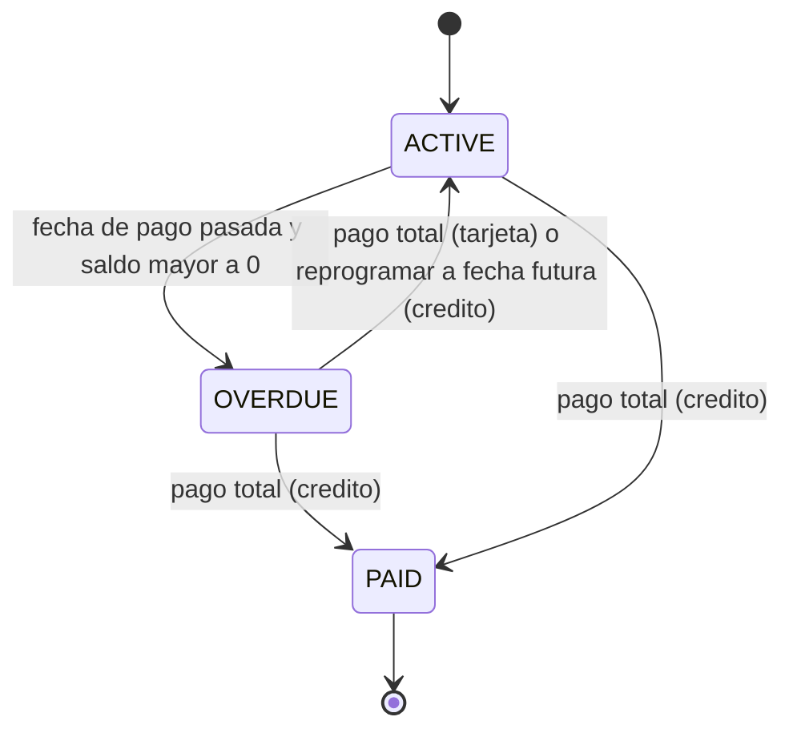
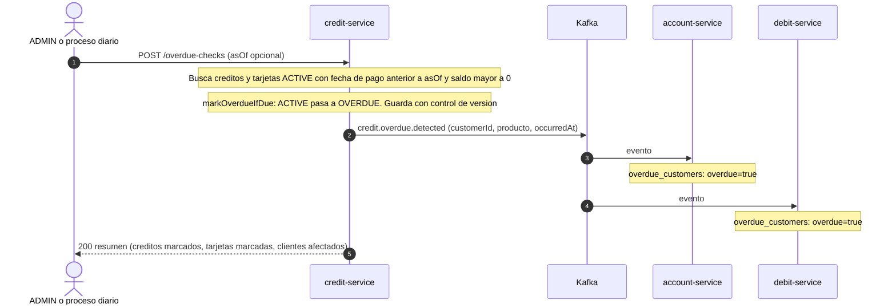
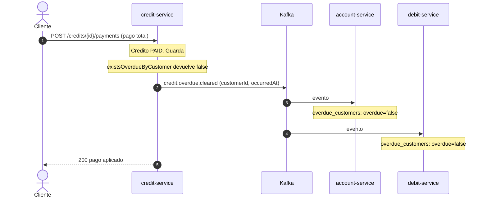
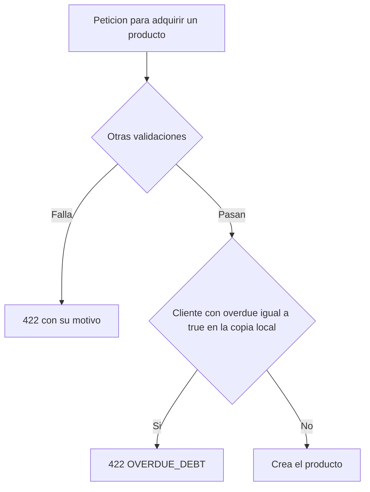

# Flujo 04 — Deuda vencida y bloqueo de adquisición

> **No es una saga.** Es una propagación de estado por eventos (consistencia eventual): `credit-service` detecta, publica, y los demás servicios guardan una copia local y bloquean con ella. No hay transacción distribuida ni compensación.
> Cubre RF-60 (Parte III): un cliente con deuda vencida **no puede adquirir** cuentas, créditos, tarjetas de crédito ni tarjetas de débito.
> Fichas relacionadas: `services/credit-service.md` (fuente de verdad), `services/account-service.md`, `services/debit-service.md`.

## 1. Resumen

| Campo | Valor |
|---|---|
| Fuente de verdad | `credit-service` (créditos y tarjetas de crédito) |
| Disparadores | Proceso diario, `POST /api/v1/overdue-checks` (manual, con `asOf` opcional) y los pagos o reprogramaciones que **limpian** la deuda |
| Mensajes | `credit.overdue.detected` y `credit.overdue.cleared` |
| Consumidores | `account-service` (bloquea abrir cuenta) y `debit-service` (bloquea emitir tarjeta de débito). `credit-service` se bloquea a sí mismo con sus propios datos |
| Alcance del bloqueo | **Solo adquirir productos nuevos.** No impide operar, pagar, consumir ni transferir |
| Fase | La detección puede correr desde P1; el bloqueo se **activa en P3** (P1/P2: `OverdueDebtPort` de `account-service` es un adaptador que siempre responde `false`) |
| Fuera de alcance | Yanki (RF-60 no cubre monederos) |

**Definición de vencido:** un producto está vencido cuando su fecha de pago ya pasó (`dueDate < asOf`) y su saldo pendiente es mayor que 0.

## 2. Estados

### 2.1 Del producto (`Credit` y `CreditCard`)

- Un **pago parcial** no limpia la deuda vencida.
- Un crédito pagado por completo pasa a `PAID`; una tarjeta pagada por completo vuelve a `ACTIVE` y limpia su fecha de pago.
- Reprogramar el crédito a una fecha futura (`PUT /credits/{id}`) lo devuelve a `ACTIVE`.

### 2.2 Del cliente (copia local en `account-service` y `debit-service`)

Cada servicio consumidor guarda un documento por cliente en `overdue_customers`:

| Campo | Significado |
|---|---|
| `customerId` | Cliente |
| `overdue` | `true` si tiene deuda vencida |
| `updatedAt` | `occurredAt` del último evento aplicado |

Un cliente sin documento se considera **sin deuda**.

## 3. Detección

`CheckOverdueUseCase` se ejecuta con el proceso diario (`@Scheduled`, zona horaria configurable, por defecto `America/Lima`) o con `POST /api/v1/overdue-checks` (`ADMIN`). El parámetro `asOf` permite simular otra fecha en el demo.

Reglas:
- **Idempotente:** un producto que ya está `OVERDUE` no se vuelve a marcar ni a publicar. Repetir la revisión no cambia nada.
- Se publica un `detected` **por producto** que pasa a vencido (el cliente puede recibir varios; los consumidores lo toleran).
- El barrido usa los índices (`status`, `dueDate`) y (`status`, `paymentDueDate`); no recorre todos los documentos.
- Si un producto falla al guardar por conflicto de versión, se reintenta y la revisión continúa con los demás.

## 4. Limpieza

Ocurre en el mismo caso de uso que aplica el pago o la reprogramación, **después de guardar** el producto:

1. El producto deja de estar vencido (pago total o reprogramación).
2. `OverdueQueryPort.existsOverdueByCustomer(customerId)` consulta las **dos colecciones**.
3. Si al cliente **no le queda ningún** producto vencido, publica `credit.overdue.cleared`.

Si le queda otro producto vencido, **no se publica** `cleared` y el bloqueo continúa.

**Sin estados atascados:** cada caso de uso primero guarda y luego consulta. Si dos pagos limpian dos productos a la vez, la última consulta ocurre después de ambas escrituras, así que al menos un proceso ve "sin deuda" y publica `cleared`. Puede haber `cleared` duplicados; son inofensivos.

## 5. Bloqueo de adquisición

| Servicio | Qué bloquea | Fuente del dato | Error |
|---|---|---|---|
| `account-service` | `POST /accounts` (todo tipo de cuenta) | `overdue_customers` (P3) | 422 `OVERDUE_DEBT` |
| `credit-service` | `POST /credits` y `POST /credit-cards` | Sus propias colecciones (`existsOverdueByCustomer`); sin read model ni eventos | 422 `OVERDUE_DEBT` |
| `debit-service` | `POST /debit-cards` (no bloquea asociar cuentas ni pagar) | `overdue_customers` | 422 `OVERDUE_DEBT` |

`credit-service` no espera a un evento: consulta su propio dato, por lo que su bloqueo es inmediato. Los otros dos dependen del evento y tienen una **ventana de consistencia** de pocos milisegundos.

**Lo que no se bloquea** (decisión de negocio, RF-60 solo habla de adquirir): depósitos, retiros, transferencias, pagos de crédito y de tarjeta, consumos, pagos con débito y pagos Yanki.

## 6. Mensajes (borrador; contrato definitivo en el documento de Kafka)

Sobre común: el definido en el flujo 01.

| Tipo de evento | Clave | `payload` |
|---|---|---|
| `credit.overdue.detected` | `customerId` | `customerId`, `productType` (`CREDIT` / `CREDIT_CARD`), `productId`, `dueDate`, `outstandingAmount`, `occurredAt` |
| `credit.overdue.cleared` | `customerId` | `customerId`, `occurredAt` |

**Un solo tópico físico: `credit.overdue`.** Los dos tipos viajan por él, con la clave `customerId`. Motivo: Kafka solo garantiza el orden **dentro de una partición**. Si `detected` y `cleared` fueran tópicos distintos, un `cleared` podría procesarse antes que su `detected` y dejar al cliente bloqueado para siempre. Con un único tópico y clave por cliente, el orden se conserva.

Reglas para los consumidores (`account`, `debit`):
- **Última escritura gana por fecha:** se aplica el evento solo si `occurredAt` ≥ `updatedAt` guardado. Un evento viejo o duplicado se ignora.
- **`detected` → `overdue=true`; `cleared` → `overdue=false`.** No se borra el documento, para conservar `updatedAt`.
- **Confirmar después de guardar** (entrega al menos una vez).
- **Reconstrucción:** el tópico se crea con **compactación** (`cleanup.policy=compact`) para conservar el último estado por cliente. Un servicio nuevo, o uno con la base vacía, se reconstruye leyendo el tópico desde el inicio.

> Principio para el documento de Kafka: **un tópico por aggregate, con el tipo de evento dentro del mensaje y la clave = id del aggregate.** Aquí es obligatorio; conviene aplicarlo también a `customer.*`, `account.*` y `credit.*`.

## 7. Consistencia y casos límite

| Situación | Qué ocurre |
|---|---|
| Ventana entre el `detected` y su consumo | `account` y `debit` aún permiten adquirir durante milisegundos. Aceptado |
| Ventana entre el `cleared` y su consumo | Aún bloquean durante milisegundos. Repetir la petición funciona |
| Un consumidor está caído | Al volver procesa los eventos pendientes y se pone al día |
| Servicio nuevo o base vacía | Se reconstruye leyendo el tópico compactado |
| Evento duplicado o fuera de orden | Se ignora por `occurredAt` |
| Pago parcial de un producto vencido | Sigue vencido; no hay evento |
| Producto vencido y cliente con otro producto vencido | El pago total de uno **no** publica `cleared` |
| Revisión ejecutada con `asOf` futuro | Marca vencidos productos que aún no lo están realmente. Es una simulación para el demo; se deshace pagando o reprogramando |
| Crédito con vencimiento pasado al crearlo | Solo con el **modo demo** (`credit.demo-mode=true`); si no, 422 `INVALID_DUE_DATE` |
| Varias instancias de `credit-service` | El proceso diario correría en todas; en el demo se despliega una sola (la revisión es idempotente, así que solo habría trabajo repetido) |

## 8. Qué ve el cliente y el operador

| Acción | Resultado |
|---|---|
| `POST /overdue-checks` | 200 con `{ creditsMarked, cardsMarked, customersAffected }` |
| Adquirir un producto con deuda vencida | 422 `OVERDUE_DEBT` |
| Pagar por completo el producto vencido | 200. Poco después, adquirir vuelve a funcionar |
| Consultar un producto vencido | `status=OVERDUE` en `GET /credits/{id}` o `GET /credit-cards/{id}` |

## 9. Pruebas del flujo

| # | Caso | Verificación |
|---|---|---|
| 1 | Revisión con un crédito vencido | Pasa a `OVERDUE`; se publica un `detected`; el resumen cuenta 1 |
| 2 | Repetir la revisión | Sin cambios ni eventos nuevos |
| 3 | Tarjeta de crédito vencida | Igual que el crédito, con `paymentDueDate` |
| 4 | `asOf` futuro | Marca vencidos los productos con fecha anterior a `asOf` |
| 5 | Producto con saldo 0 y fecha pasada | No se marca vencido |
| 6 | Abrir cuenta con deuda vencida (tras el evento) | 422 `OVERDUE_DEBT` en `account-service` |
| 7 | Emitir tarjeta de débito con deuda vencida | 422 `OVERDUE_DEBT` en `debit-service` |
| 8 | Emitir crédito o tarjeta de crédito con deuda vencida | 422 inmediato, sin depender de eventos |
| 9 | Operar, transferir, pagar con débito o con Yanki con deuda vencida | **Funciona** |
| 10 | Pago parcial | Sigue `OVERDUE`; no hay `cleared` |
| 11 | Pago total del único producto vencido | `PAID` (o `ACTIVE` en tarjeta); `cleared`; el bloqueo se levanta |
| 12 | Dos productos vencidos, pago total de uno | Sin `cleared`; el bloqueo sigue |
| 13 | Reprogramar el crédito a fecha futura | Vuelve a `ACTIVE`; `cleared` si era el último |
| 14 | `cleared` antes que `detected` (mensajes fuera de orden) | El consumidor aplica por `occurredAt`; el estado final es correcto |
| 15 | Evento duplicado | Sin efecto |
| 16 | Consumidor con la base vacía | Se reconstruye leyendo el tópico compactado |
| 17 | Modo demo desactivado y `dueDate` pasada | 422 `INVALID_DUE_DATE` |

## 9.1 Guion de demo (resumen)

Corresponde a los pasos 22 a 25 de la definición general:
1. Con `credit.demo-mode=true`, crear el crédito de C con `dueDate` pasada.
2. `POST /overdue-checks` → el crédito queda `OVERDUE`.
3. Intentar `POST /accounts`, `POST /credits`, `POST /credit-cards` y `POST /debit-cards` para C → 422 `OVERDUE_DEBT`.
4. Comprobar que C **sí puede** depositar, transferir y pagar.
5. Pagar el crédito por completo → esperar unos segundos → repetir el paso 3 → 201.

## 10. Decisiones y pendientes

**Decidido**
- No es una saga: es propagación de estado por eventos (event-carried state) con copia local. Sin compensación.
- `credit-service` es la única fuente; los demás nunca preguntan por REST.
- `detected` por producto y `cleared` por cliente (cuando ya no le queda ninguno).
- Un tópico físico `credit.overdue`, con clave `customerId` y compactación, para no perder el orden.
- Consumidores con estado `overdue` + `updatedAt` (última escritura gana por `occurredAt`).
- El bloqueo cubre solo la adquisición de productos; la detección funciona desde P1 y el bloqueo se activa en P3.

**Cambios que este flujo pide a las fichas** (aplicados)
- `credit-service`: los eventos de deuda viajan por un solo tópico `credit.overdue`; `credit.overdue.detected` incluye `dueDate` y `outstandingAmount`; propiedad `credit.demo-mode`; el resultado de `POST /overdue-checks` es `{ creditsMarked, cardsMarked, customersAffected }`.
- `account-service` y `debit-service`: el read model `overdue_customers` guarda `customerId`, `overdue` y `updatedAt`, con la regla de última escritura gana.

**Pendiente**
- Hora del proceso diario (propuesta: 01:00 America/Lima).
- Notificar al cliente de su deuda: fuera de alcance.
- Intereses y moras: fuera de alcance (la ficha no los modela).
- Configuración del tópico compactado en el `docker-compose` de Kafka (parte del documento de Kafka).
- Outbox para publicar los eventos (común a todos los flujos).
