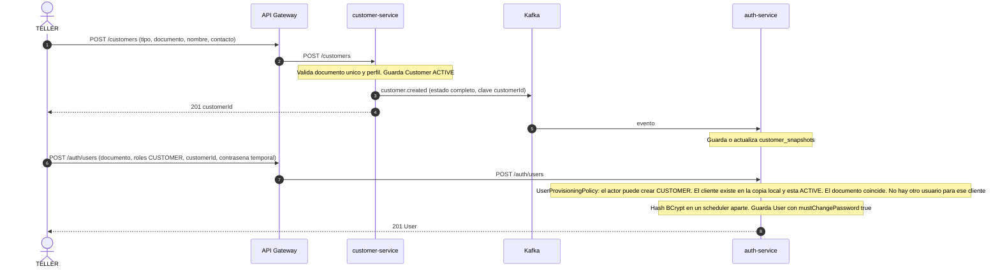
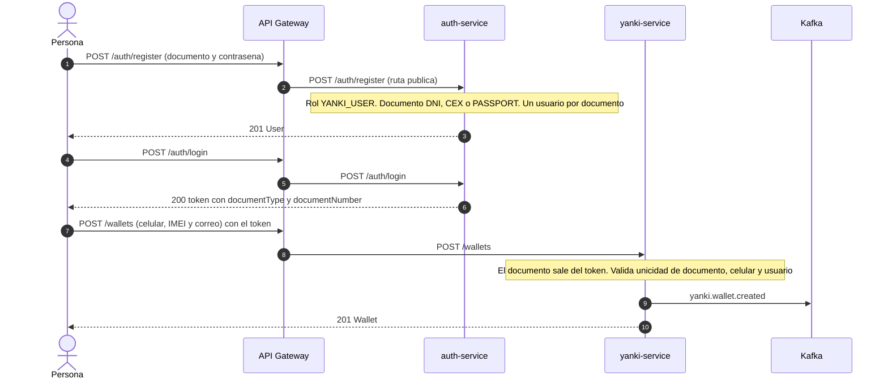
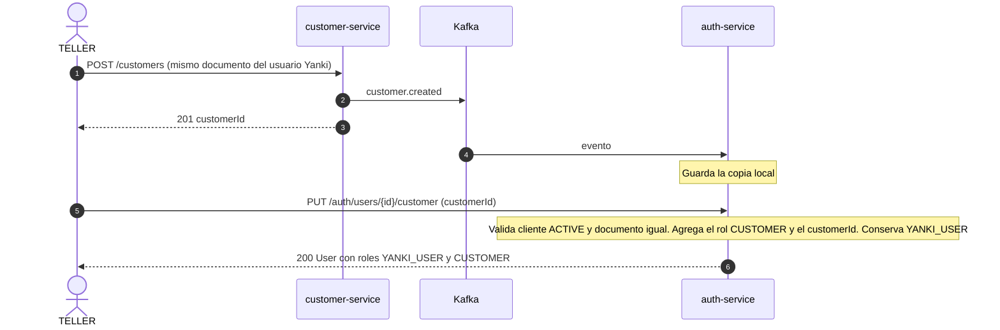
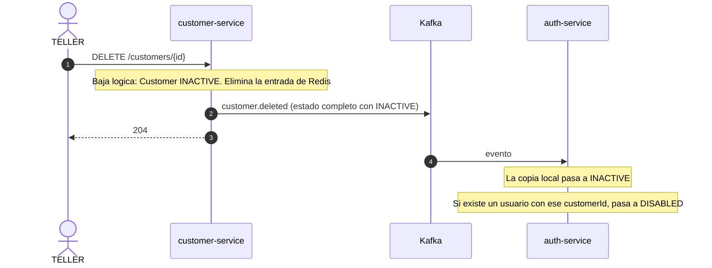
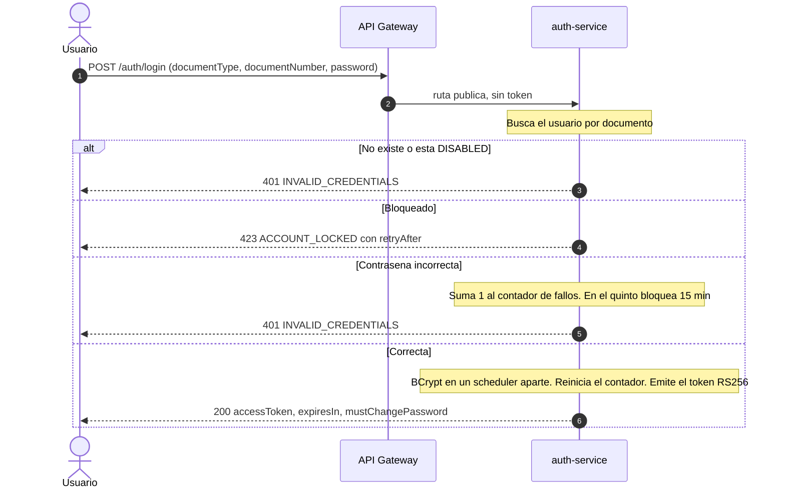
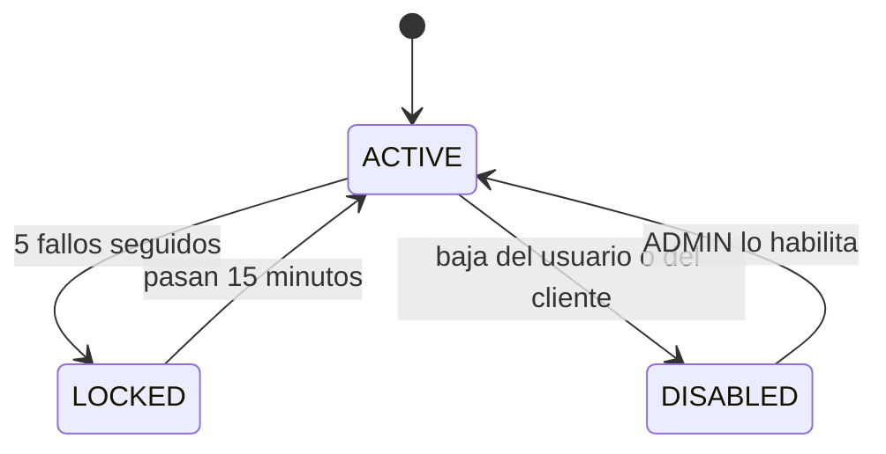
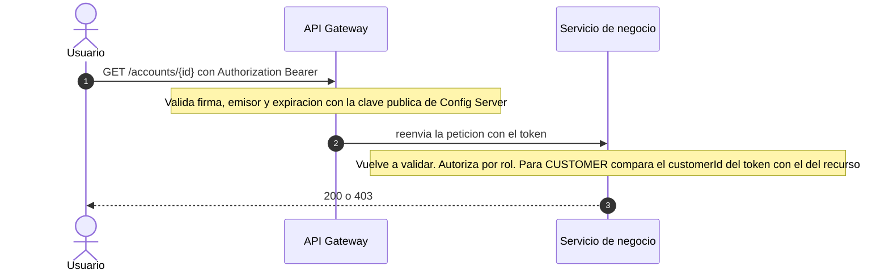

# Flujo 05 — Alta de cliente y acceso (usuarios y token)

> **No es una saga.** Son pasos independientes entre servicios que no se comunican por REST: `customer-service` publica eventos, `auth-service` guarda una copia local de los clientes y con ella verifica a quién le crea un usuario. Sin compensación; la consistencia es eventual.
> Cubre RNF-27 (JWT) y lo necesario para que la demo tenga a quién autenticar: cómo obtiene acceso cada persona.
> Fichas relacionadas: `services/customer-service.md`, `services/auth-service.md`, `services/yanki-service.md`. Reglas de acceso: `bootcamp-bank-microservices-definition.md`, sección 6.
> Fase: P3 (con `security.enabled=true`). En P1/P2 solo existe el paso de crear el cliente, sin usuarios ni tokens.

## 1. Resumen

| Escenario | Quién lo dispara | Servicios | Resultado |
|---|---|---|---|
| **A.** Alta de un cliente del banco y de su usuario | `TELLER` / `ADMIN` | `customer` → (evento) → `auth` | Cliente con usuario `CUSTOMER` que puede iniciar sesión |
| **B.** Registro Yanki (sin ser cliente) | La propia persona | `auth` y luego `yanki` | Usuario `YANKI_USER` con monedero |
| **C.** Un usuario Yanki pasa a ser cliente | `TELLER` / `ADMIN` | `customer` → (evento) → `auth` | El mismo usuario recibe el rol `CUSTOMER` y su `customerId` |
| **D.** Baja de un cliente | `TELLER` / `ADMIN` | `customer` → (evento) → `auth` | Su usuario queda deshabilitado |
| **E.** Inicio de sesión y validación del token | Cualquier usuario | `auth`, Gateway y servicios | Token RS256 validado en cada llamada, sin llamar a `auth` |

**Principios**
- **Un usuario por persona, identificada por su documento.** El login es documento + contraseña.
- **`auth-service` no llama a nadie.** Para saber si un cliente existe usa su copia local, alimentada por eventos.
- **Nadie llama a `auth-service` para validar un token:** el Gateway y los servicios validan con la clave pública (Config Server).
- **Quién puede qué:** `ADMIN` crea `TELLER`; `ADMIN` y `TELLER` crean usuarios `CUSTOMER`; cualquiera se registra como `YANKI_USER`.

## 2. Datos que viajan

### 2.1 Evento de cliente (borrador; contrato definitivo en el documento de Kafka)

Un **solo tópico `customer`**, con clave `customerId` y el tipo de evento dentro del mensaje (`customer.created`, `customer.updated`, `customer.deleted`). Mismo principio que en el flujo 04: Kafka solo ordena dentro de una partición, así que un `deleted` nunca debe adelantarse a un `created` de otro tópico.

Cada evento lleva el **estado completo actual** del cliente, no solo lo que cambió:

```json
{
  "eventType": "customer.updated",
  "occurredAt": "2026-09-24T10:24:00Z",
  "payload": {
    "customerId": "cus-001",
    "type": "PERSONAL",
    "profile": "VIP",
    "status": "ACTIVE",
    "document": { "type": "DNI", "number": "12345678" },
    "name": "Ana Torres",
    "updatedAt": "2026-09-24T10:24:00Z"
  }
}
```

Motivo: quien reciba primero un `updated` (por ejemplo tras reconstruir su base) puede armar la copia completa sin haber visto el `created`.

### 2.2 Copia local en `auth-service` (`customer_snapshots`)

| Campo | Significado |
|---|---|
| `customerId` | Cliente |
| `document` | Tipo y número (no cambia nunca: `customer-service` no permite editarlo) |
| `status` | `ACTIVE` o `INACTIVE` |
| `updatedAt` | Se aplica un evento solo si su `updatedAt` es igual o más reciente que el guardado (última escritura gana). Un evento viejo o duplicado se ignora |

### 2.3 Claims del token

`sub` (userId), `roles`, `customerId` (si tiene), **`documentType` y `documentNumber`**, `iss`, `iat`, `exp`, `jti`. El documento en el token permite a `yanki-service` saber a quién pertenece el monedero **sin llamar a nadie** y sin confiar en lo que diga el cuerpo de la petición.

## 3. Escenario A: alta de un cliente y de su usuario



**Validaciones de `POST /auth/users` para un `CUSTOMER`** (`UserProvisioningPolicy`):

| Validación | Error |
|---|---|
| El actor es `ADMIN` o `TELLER` (`TELLER` solo crea `CUSTOMER`) | 403 `ROLE_NOT_ALLOWED` |
| El `customerId` existe en la copia local | 422 `CUSTOMER_NOT_FOUND` |
| El cliente está `ACTIVE` | 422 `CUSTOMER_INACTIVE` |
| El documento del usuario **coincide** con el del cliente (RUC para empresas) | 422 `DOCUMENT_MISMATCH` |
| No existe otro usuario para ese `customerId` | 422 `CUSTOMER_ALREADY_LINKED` |
| No existe un usuario con ese documento | 409 `USER_ALREADY_EXISTS` (si era un `YANKI_USER`, ver escenario C) |
| La contraseña cumple la política | 422 `WEAK_PASSWORD` |

**Consistencia eventual:** si el `TELLER` crea el usuario **antes** de que el evento llegue a `auth-service`, la respuesta es 422 `CUSTOMER_NOT_FOUND`. Es transitorio: se repite la petición a los pocos instantes. En el guion de Postman conviene un paso de espera o un reintento entre los dos pasos.

**Entrega de la contraseña temporal:** fuera de alcance. En el demo la fija quien crea el usuario y la comunica por otro medio. El usuario nace con `mustChangePassword=true` y la cambia con `PUT /auth/password`.

## 4. Escenario B: registro Yanki (sin ser cliente)

Tres pasos, el primero público:



Reglas:
- **El documento del monedero es el del token**, no el que diga el cuerpo. Así nadie puede registrar un monedero con el documento de otra persona ni, después, asociar la tarjeta de un tercero (la asociación compara el documento del monedero con el del titular de la tarjeta).
- Solo documentos DNI, CEX o PASSPORT: un usuario con RUC (empresa) recibe 422 `DOCUMENT_TYPE_NOT_ALLOWED` al crear un monedero.
- `POST /wallets` lo pueden usar `YANKI_USER` y `CUSTOMER`: un cliente del banco **no se registra otra vez**; usa su usuario y crea el monedero con su token.
- Un documento que ya tiene usuario recibe 409 `USER_ALREADY_EXISTS` en `/auth/register` (se acepta que revele que ya existe).

## 5. Escenario C: un usuario Yanki pasa a ser cliente

Una persona que ya se registró en Yanki abre después una relación con el banco. **No se le crea otro usuario**: se le vincula el cliente.



- Si en vez de vincular se intenta `POST /auth/users` con ese documento, la respuesta es 409 `USER_ALREADY_EXISTS`.
- Los tokens ya emitidos **no cambian**: el nuevo rol y el `customerId` aparecen en el **siguiente login**.
- El monedero Yanki existente no se toca.

## 6. Escenario D: baja de un cliente



- Un usuario `DISABLED` no puede iniciar sesión (responde igual que credenciales inválidas).
- **Sus tokens siguen siendo válidos hasta que expiren (máximo 30 minutos).** No hay revocación; se acepta para el demo.
- Los servicios que guardan copia de clientes (`account`, `credit`, `debit`, `yanki`) pasan el cliente a `INACTIVE` y dejan de permitirle adquirir productos. Sus productos existentes no se modifican.
- Si el cliente dado de baja tenía un monedero Yanki, este **no** se cierra ni se bloquea.

## 7. Escenario E: inicio de sesión y validación del token

### 7.1 Login



Estados de seguridad del usuario:



Detalles:
- Todos los fallos de credenciales responden igual (`INVALID_CREDENTIALS`) para no revelar si el usuario existe. El bloqueo sí se informa (423).
- El contador se actualiza con control optimista (`version`) para que dos intentos simultáneos no se pisen.
- El hash BCrypt es trabajo de CPU: se ejecuta en un scheduler de RxJava aparte, nunca en el hilo reactivo.
- `mustChangePassword` se informa pero **no se fuerza**: el token sirve igual. Si se quisiera forzar, sería una restricción adicional en el Gateway.

### 7.2 Uso del token en cada llamada



- Ni el Gateway ni los servicios llaman a `auth-service`: por eso su caída **no** afecta a quien ya tiene un token, solo impide nuevos logins.
- Con `security.enabled=false` (P1/P2), Gateway y servicios dejan pasar sin token.
- Respuestas: 401 sin token o token inválido o vencido; 403 con token válido pero sin permiso o sobre un recurso ajeno.

## 8. Fallos y consistencia

| Situación | Qué ocurre |
|---|---|
| El usuario se crea antes de que llegue el evento del cliente | 422 `CUSTOMER_NOT_FOUND`; se repite en unos instantes |
| Evento de cliente duplicado o fuera de orden | Se ignora por `updatedAt`; el estado final es correcto |
| `auth-service` caído | No hay logins nuevos; los tokens vigentes siguen sirviendo |
| `auth-service` arranca con la base vacía | Se reconstruye la copia de clientes leyendo el tópico `customer` desde el inicio (tópico compactado) |
| Dos usuarios `TELLER` crean a la vez el usuario del mismo cliente | El índice único parcial sobre `customerId` deja pasar uno; el otro recibe 409 |
| Un cliente sin usuario | Es válido: existe en el banco pero no tiene acceso por API |
| Se cambia el rol de un usuario | Se ve en su **siguiente login** (los tokens llevan los roles fijos) |
| Último `ADMIN` | No se puede deshabilitar, eliminar ni quitarle el rol (`LAST_ADMIN`) |
| Arranque inicial | `SeedAdminUseCase` crea el `ADMIN` desde variables de entorno si no existe ninguno |
| Clave privada | Nunca sale de `auth-service` (variable o secreto). La pública se publica por Config Server y en `/.well-known/jwks.json` |

## 9. Pruebas del flujo

| # | Caso | Verificación |
|---|---|---|
| 1 | Crear cliente y luego su usuario | 201 en ambos; el cliente puede iniciar sesión |
| 2 | Crear el usuario antes del evento | 422 `CUSTOMER_NOT_FOUND`; tras esperar, 201 |
| 3 | Documento del usuario distinto al del cliente | 422 `DOCUMENT_MISMATCH` |
| 4 | Cliente `INACTIVE` | 422 `CUSTOMER_INACTIVE` |
| 5 | Segundo usuario para el mismo cliente | 422 `CUSTOMER_ALREADY_LINKED` |
| 6 | `TELLER` intenta crear un `TELLER` o un `ADMIN` | 403 `ROLE_NOT_ALLOWED` |
| 7 | Registro Yanki completo | Usuario, login y monedero; el documento del monedero es el del token |
| 8 | Crear un monedero con un documento distinto en el cuerpo | El cuerpo no lo admite; se usa el del token |
| 9 | Usuario con RUC crea un monedero | 422 `DOCUMENT_TYPE_NOT_ALLOWED` |
| 10 | Registro Yanki con un documento que ya tiene usuario | 409 |
| 11 | Vincular un cliente a un usuario Yanki | Roles `YANKI_USER` y `CUSTOMER`; el nuevo token trae `customerId` |
| 12 | Baja de un cliente | Su usuario queda `DISABLED`; el login responde 401 |
| 13 | Token de un usuario recién deshabilitado | Sigue válido hasta expirar |
| 14 | Cinco contraseñas incorrectas | 423 con `retryAfter`; tras 15 minutos vuelve a entrar |
| 15 | Login correcto tras fallos previos | Reinicia el contador |
| 16 | Token vencido, alterado o sin firma | 401 en Gateway y en el servicio |
| 17 | `CUSTOMER` pide un recurso de otro cliente | 403 |
| 18 | Eventos de cliente duplicados o desordenados | La copia local queda correcta |
| 19 | Seed del `ADMIN` repetido | Idempotente: no crea un segundo `ADMIN` |

> **Contrato exacto:** `contracts/auth-service/` (`openapi.yaml`, `data-model.md`). Precisiones del contrato sobre este flujo: el `TELLER` ve y vincula a los usuarios de clientes, incluidos los `YANKI_USER`; el quinto intento fallido ya responde 423; vincular es idempotente; el orden de validaciones al crear un usuario `CUSTOMER` está en la sección 3.3 del `data-model.md`.

## 10. Decisiones y pendientes

**Decidido**
- No hay saga: eventos de estado y copias locales. `auth-service` nunca llama a otro servicio.
- El documento viaja en el **token** (`documentType`, `documentNumber`) y el monedero Yanki lo toma de allí.
- Un solo tópico `customer` con estado completo en cada evento, clave `customerId` y compactación.
- Copias locales con `updatedAt` (última escritura gana).
- Un usuario por documento y por cliente. Un `YANKI_USER` que se vuelve cliente conserva su usuario.
- La baja de un cliente deshabilita a su usuario, pero no revoca tokens ni cierra su monedero.

**Cambios que este flujo pide a las fichas** (aplicados)
- `customer-service`: los eventos llevan el estado completo (`document`, `name`, `updatedAt`) y viajan por un solo tópico `customer`.
- `auth-service`: el token incluye `documentType` y `documentNumber`; la copia local guarda `updatedAt`.
- `yanki-service`: `POST /wallets` toma el documento del token (el cuerpo solo trae celular, IMEI y correo) y responde 422 `DOCUMENT_TYPE_NOT_ALLOWED` si es RUC.
- Definición general: claims del token y pasos 30 y 31 del guion.

**Pendiente**
- Si se quisiera forzar el cambio de contraseña inicial (`mustChangePassword`), habría que restringir las demás rutas hasta que se cambie.
- Revocación de tokens al deshabilitar un usuario: hoy hasta 30 minutos de ventana.
- Entrega de la contraseña temporal y recuperación de contraseña: fuera de alcance.
- Rotación de la clave de firma: hoy implica reiniciar Gateway y servicios.
- Un `YANKI_USER` sin monedero puede quedarse sin crearlo; no hay limpieza automática.
